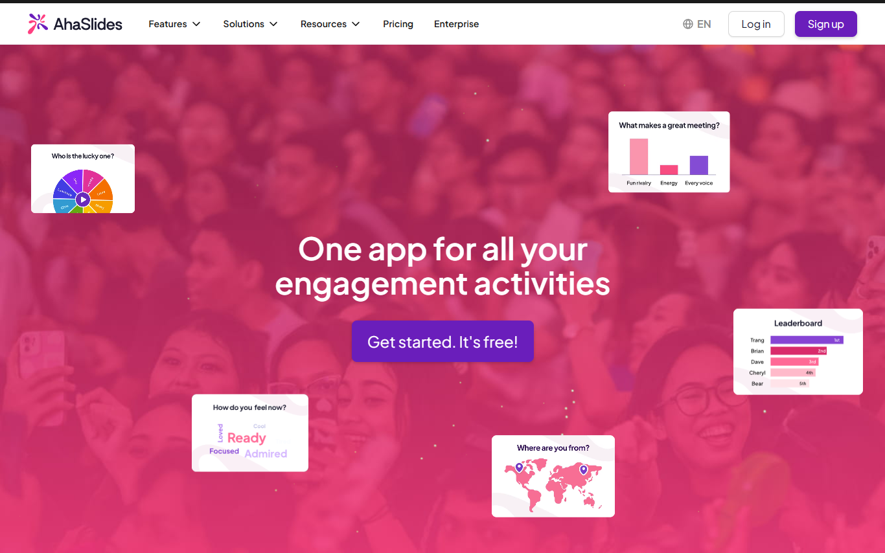
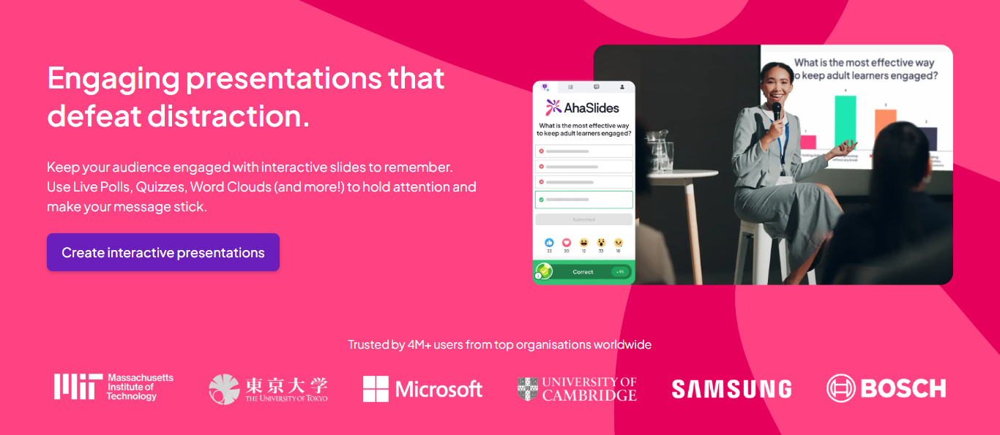
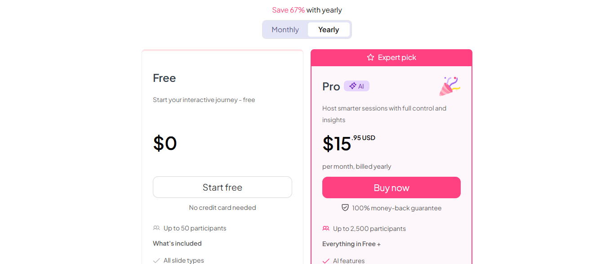
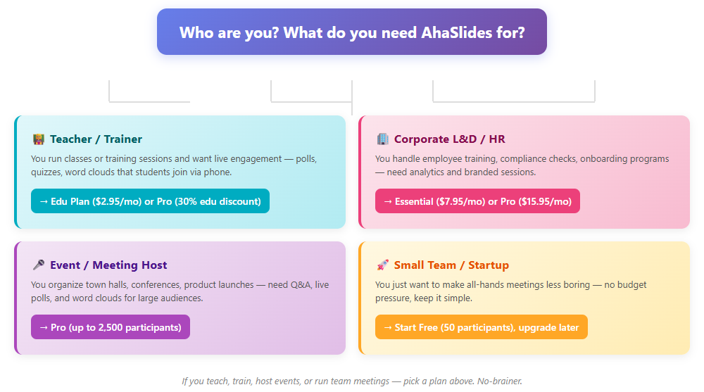

# AhaSlides：把"台下睡成一片"的 PPT，变成全场举着手机参与

我们上周开季度会。第一页 PPT 讲到一半，扫一眼台下，一半人盯着手机刷别的。会开完，啥也没记住。

后来有人甩来一个链接：AhaSlides。上传 PPT，往里面塞几个实时投票、一个词云、一局 Quiz，台下的人掏出手机扫码就能参与。当场气氛就不一样了。

我们认真研究了两周，把官网资料、G2 上几百条真实评价、微软 AppSource 的评论都翻了一遍。这篇是完整版——它能干嘛、值不值、适合谁，一次说清。

👉 **官方演示视频（2 分钟看懂它）：**

<iframe src="https://www.youtube.com/embed/4xyVd-qWTxs" title="AhaSlides 官方演示" width="100%" height="420" style="border:none;border-radius:12px;aspect-ratio:16/9;max-width:720px;" allowfullscreen loading="lazy"></iframe>



## 一句话结论（TL;DR）

AhaSlides 是一款把「实时互动」直接做进演示文稿的 SaaS 工具：投票、词云、问答、Quiz、转盘抽奖，观众扫码即玩，不用装任何 App。

| 项目    | 数值                           |
| ----- | ---------------------------- |
| 免费版   | 50 人/场，免信用卡，场次不限             |
| G2 评分 | 4.6/5（G2）                     |
| 退款    | 14 天 100% 无理由                |

**优点（说真的，它确实能打）**

- 上手零门槛：做 PPT 的方式加互动，观众扫码就进，不用培训
- 效果立竿见影：投票、词云、Quiz 一套下来，冷场基本不存在
- 全套功能一把抓：别人要分开买的投票+问答+竞答，它一个订阅全有
- 便宜：同等定位比 Mentimeter/Slido 便宜 40–70%，教育版更是白菜价
- 数据拿得到：会后导出参与报告，下次改进有依据

**要注意的点（诚实说）**

- 免费版单场上限 50 人，大班课或大型活动会卡在门槛上
- 百人以上的大型现场，最好提前测试网络——互动依赖实时连接
- 模板自由度中等：想要像素级自定义设计，它不如纯设计工具

**适合谁 / 不适合谁**

- 适合：教师/培训师、企业 L\&D 与 HR、会议/活动组织者、常开全员会的小团队
- 不适合：需要完整营销自动化（注册页/邮件序列/回放）的纯 webinar 需求

## 为什么说它是 Mentimeter 平替（价格与人数对比）

搜索 AhaSlides 的人，多半是被 Mentimeter / Slido 的收费劝退的——尤其是小团队和老师。先看一张对比表：

| 维度       | AhaSlides                                  | Mentimeter                              |
| -------- | ---------------------------------------- | ------------------------------------- |
| 免费版额度   | 50 人/场，**场次不限**，5 Quiz + 3 Poll/场           | 50 参与者/月（**按月累计总量**）                    |
| 付费计费方式 | **月付 / 年付任选**                              | 付费套餐**仅年付**                            |
| 起步价（年付） | Essential $7.95/月                         | Basic $11.99/月起（第三方参考价）                |

同样是"50 人"，AhaSlides 是**每场 50 人、想开几场开几场**，Mentimeter 是**每月累计 50 人**——开月度全员会、带多班教学的老师，这个差别一眼就分出胜负。更关键的是计费：AhaSlides 可以月付，Mentimeter 付费只能一年一锁。小团队和老师最怕的就是"先押一年"，这一点是 AhaSlides 最大的转化杀手锏。

## 谁在背后：一家 0 融资做大的新加坡公司

AhaSlides 2019 年在新加坡创立，创始人 Dave Bui。有意思的地方在于：这家公司没拿一分钱外部融资，靠收入滚到今天——年营收 400 多万美元，团队才 40 来人，服务了 400 万+ 演示者、覆盖 180+ 国家。客户名单里有联合国、空客、AIA 集团这种名字。

还拿了 G2 的「2026 最佳软件产品」徽章——在一群拿了 VC 巨款的对手（Kahoot、Cisco 旗下的 Slido）中间，这个成绩挺能说明问题。

安全上：GDPR 合规 + 行业标准加密，另提供数据处理协议（DPA），对欧盟用户友好。

**它的 AI 怎么工作**：内置 AI 演示助手，输入主题就自动生成一套带投票和 Quiz 的互动稿；也能直接把你上传的 PDF/PPT 转成竞答题目。免费版每月 5 次 AI 生成，Pro 版不限次数。

## 它到底能干嘛（分项拆解）

**现场表现（实测体感）**：我们在一次 30 人的线上会议里实测，手机扫码基本秒进，投票和词云刷新没有卡顿感。嵌进 PowerPoint 后，整个演示就在 PPT 里跑，全程不用来回切标签页。

- **实时投票 + 词云**：一个问题丢出去，答案实时上屏。头脑风暴、暖场、收集意见，都在几秒钟内完成。
- **互动 Quiz（7 种题型）**：单选、配对、排序、分类……带计时、音效、实时排行榜。团建和培训课的保留节目。
- **匿名 Q\&A + 置顶**：听众匿名提问、投票顶上最关心的问题，主讲人可以审核、置顶。全员会、发布会最实用。
- **转盘抽奖 + 图片定位**：抽奖暖场、地图/海报上"点位置投票"，场景很灵活。
- **无缝嵌入 PPT / Google Slides / Teams / Zoom**：不用切换窗口，互动直接嵌在演示流里——而且所有集成在所有套餐（包括免费版）都免费开放，这一点竞品大多做不到。
- **观众零门槛**：扫码或输网址就进，不用下载 App。



## 价格怎么选（2026 年 8 月核验）

| 套餐              | 年付价/月      | 单场人数    | 关键能力                        |
| --------------- | ---------- | ------- | --------------------------- |
| Free            | $0         | 50      | 全部题型、5 Quiz + 3 投票/场、无限场次   |
| Essential       | $7.95      | 100     | 无限互动页、数据分析导出、文件夹管理          |
| Pro             | $15.95     | 2,500   | AI 不限次、品牌 Logo、Q\&A 审核、优先支持 |
| Enterprise      | 定制         | 100,000 | SSO/SCIM、专属客户经理、组织看板        |
| Edu Small→Large | $2.95–7.65 | 50–200  | 教育专属：无限 Quiz/投票、成绩报告        |

年付比月付省约 67%（月付价：Essential $23.95、Pro $49.95；年付分别 $7.95 / $15.95）。14 天全额退款。多人团队套餐最高再省 20%。教育工作者请直接选专属 **Edu 套餐**（$2.95–$7.65/月，年付）——比买 Pro 更划算；官网并没有「教师额外 30% 折扣 Pro」这类活动。

> 注：官网会不定期推限时促销，部分档位实时价可能低于上表标准年付价（例如 Pro 年付曾在促销窗出现 $11.15）。下表为「省 67%」的标准年付价，最终以下单页 ahaslides.com/pricing 实时显示为准。价格核验于 2026 年 8 月。

> ⚠️ **人数上限避坑**：免费版每场上限 50 人——**超过的人进不来**（不是被踢出，是根本加不进来，官网 FAQ 原话）。大课、大型活动务必提前升套餐：教育者走 Edu（$2.95–7.65），大会/发布会直接上 Pro（2,500 人）；一年只办一两次大型活动的，按需买月付档、跑完当月就取消，别锁年付。

## 和竞品比，它赢在哪

| 维度   | AhaSlides       | Mentimeter | Kahoot! | Slido   |
| ---- | --------------- | ---------- | ------- | ------- |
| 定位   | 全能互动演示          | 企业设计感      | K12 游戏化 | 会议 Q\&A |
| 起步价  | $0 / $7.95      | 更高         | 免费+收费   | 免费+收费   |
| 场景覆盖 | 投票+问答+竞答+完整 PPT | 投票问答为主     | 偏竞答     | 偏问答     |
| 性价比  | 同类里最能打          | 中          | 中       | 中       |

一句话：Mentimeter 的省钱替代 + 比 Kahoot 更适合商务和综合教学的万能互动工具。



## 该不该买？决策树

- **老师 / 培训师** ➔ 直接选 Edu 版（$2.95/月起，年付）——备课用 AI 生成题目，课堂全员手机参与（教育者走专属 Edu 套餐，比买 Pro 更划算）
- **企业 L\&D / HR** ➔ 选 Essential 或 Pro——培训、合规考试、新人 onboarding 都能上互动
- **会议 / 活动组织者** ➔ 选 Pro（2500 人）——现场 Q\&A、投票、词云一条龙
- **小团队 / 创业者** ➔ 先白嫖免费版（50 人够用），人多了再升

如果你教课、带培训、办活动、开全员会——选它，没有悬念。

👉 [了解或购买](https://ahaslides.com/?source=reditus\&red=reditus)



## 我们怎么写这篇（透明说明）

数据来源：AhaSlides 官网定价页与功能页、G2（4.6/5）、Capterra、微软 AppSource 评论，以及第三方评测站公开资料，核验于 2026 年 8 月。我们只亲测主要功能，负面反馈来自真实用户评论并作缓和处理。价格随时会变，下单前以官网为准。

## 联盟披露

本文含联盟链接。你通过链接购买，我们可能获得佣金。这不影响我们的评测、评分或所说的话。我们只写自己用的工具。

---

*资料来源：ahaslides.com/pricing、G2（4.6/5）、Capterra、微软 AppSource、TopRatedAI/FitGap 等公开评测（2026 年 8 月核验）。*

## X Thread（引流用，发在 X / Twitter）

```
Death by PowerPoint? There's a fix.

We tested AhaSlides for 2 weeks:
- Live polls, word clouds, quizzes
- Audience joins by QR code, no app
- AI turns your PDF into quiz questions
- Free plan: 50 participants
- G2 4.6/5

Teachers, trainers, event hosts — this is for you.

Full breakdown 👇
[your affiliate link]
```
