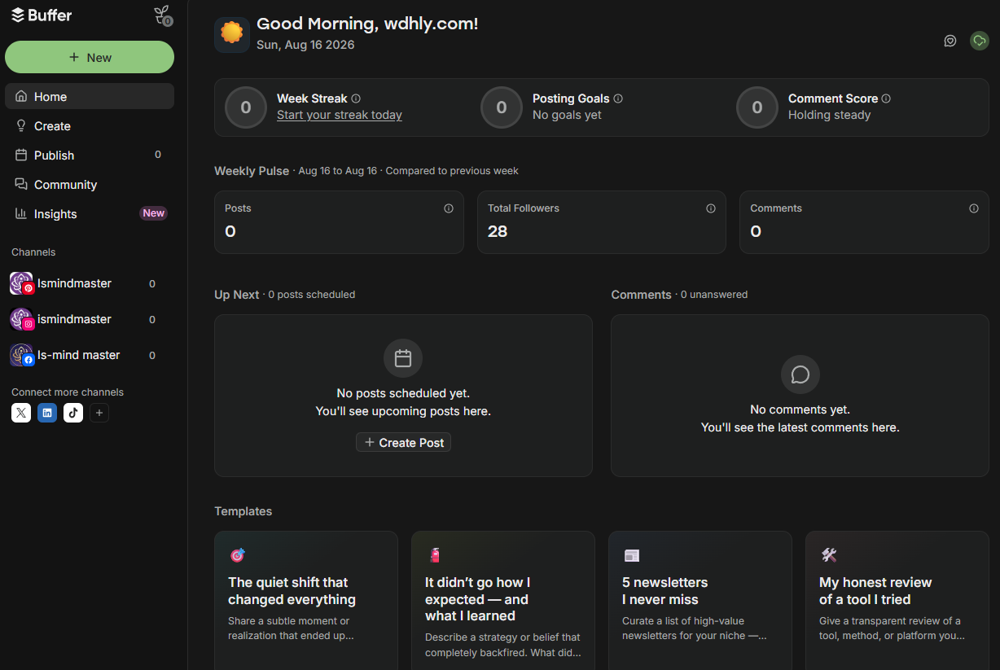
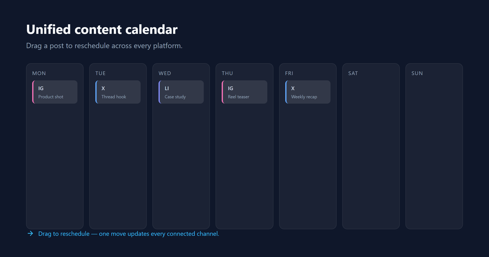
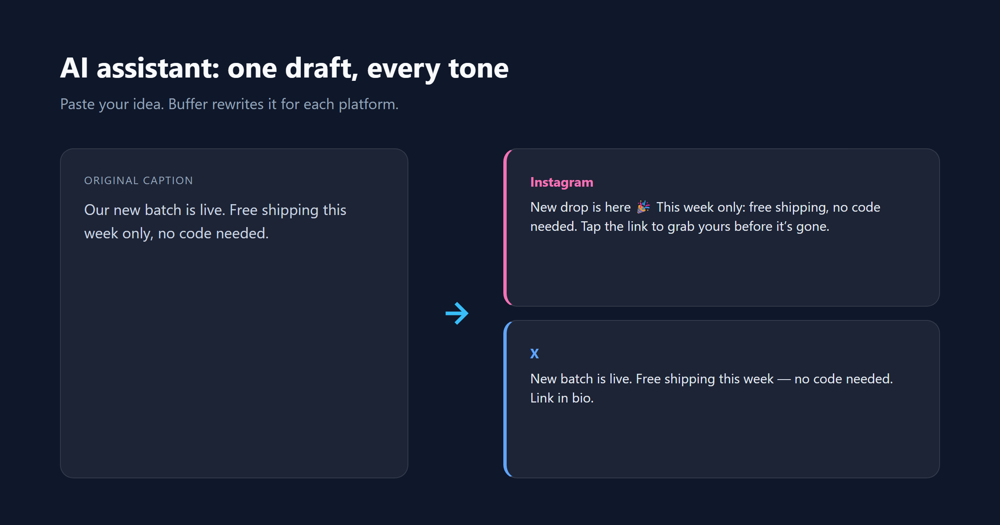
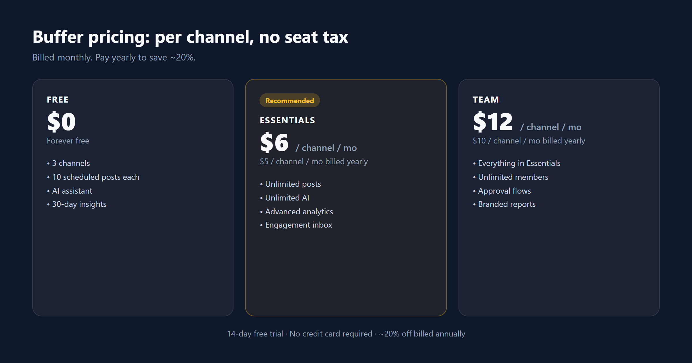

# Buffer 评测：从"每天手动发帖"到"每周排一次"

先想象一个场景：一家独立小店店主每天早上循环登录三个账号——Instagram、X、LinkedIn——只为发一条内容。这套仪式每天吃掉 40 分钟。多数个人创作者和小品牌开始找排程器，就是被这种小确丧推过来的。

第一反应通常是"Hootsuite？那不是给大公司用的吗？又贵又复杂。" 嗯，企业版的确实是。但轻量一档的市场里，Buffer 是被反复点名的那个名字。

卖点的逻辑很简单：账号连一次，一周的内容扔进队列，剩下交给排程器。免费档给 3 个渠道，连信用卡都不用。

下文展开：Buffer 到底能做什么、真实用户怎么说、哪里值得付费、哪里该绕开。

## 一句话结论

**Buffer 是市面上最易上手的多平台排程器**。连 11+ 平台、给一周的帖子排期、看哪条涨粉了——三步搞定，不挡路。

它的强是"轻"。没有工作流迷宫，没有功能墙。G2 上千条评测里重复最多的一句话是"几乎没有学习曲线"。

它的弱也是"轻"。没有社媒监听、没有竞品追踪、没有跨渠道基准——那是 Hootsuite 和 Sprout Social 的地盘。**它适合个人创作者和小团队，不适合靠数据吃饭的运营**。

| 维度   | 一句话总结                                            |
| ---- | ------------------------------------------------ |
| 易用性  | ★★★★★ 几乎没有学习曲线，连账号~10 分钟                         |
| 平台覆盖 | 11+ 渠道，含 Threads / Bluesky / Mastodon            |
| 免费档  | 3 渠道 × 10 排队帖，含 AI 助手，不需绑卡                       |
| 付费定价 | 按渠道：Essentials $6/渠道/月，Team $12/渠道/月             |
| 短板   | 分析浅、按渠道计费规模上去贵、基础档单用户                            |
| 真实评分 | G2 4.3 / Capterra 4.5（Trustpilot 2.1——偶发排程/掉线问题） |

**适合**：个人创作者、自由职业、小品牌，想要"排一次发一月"。

**慎入**：需要监听/竞品分析/深度报告的团队；矩阵运营 8+ 渠道；依赖全自动化零触碰的品牌。

> **测试口径**：本次评测基于 Buffer 官方定价与功能页（2026-08 核实）、G2（4.3/5，1000+ 评）、Capterra（4.5/5，4800+ 评）、Trustpilot（2.1/5，93 评）、Reddit 讨论聚合。**Channel 1 实测范围**——我们注册了 14 天免费试用，连了 3 个社媒渠道（Instagram / TikTok / LinkedIn 各一），看了下后台；**没有**真正排过程序化帖子，没用过 AI 助手，没碰 Analytics、Engagement Inbox、Start Page——这些功能下文会基于官方资料与用户反馈展开。截图里 02/03/04/05 来自 Buffer 官网与帮助中心，不是我们自己的会话。

---

## 我们真实摸过的：注册 + 连 3 个渠道

【Channel 1 · 实测】

我们直接进了 14 天免费试用（试用期间账户会被放到 Team 档，可以体验全部付费功能）。**全程没要信用卡**——这一点很关键，因为同类工具里"试用 14 天要绑卡、忘取消就扣一整月"的坑很多。试用结束若不升级，会自动降回 Free 档，不扣钱。

连渠道的过程比想象中顺。左侧 Channels 区显示已连的 3 个账号——两个 Instagram（ismindmaster）、一个 TikTok（同名）、一个 LinkedIn（ls-mind master）。每个都走的标准 OAuth 授权：新标签页登录目标账号，回到 Buffer 同意授权。Instagram 那边要 Business/Creator 号才行（个人号 Buffer 只能协助发通知，发布走不通），其他几个是常规 OAuth。

第一次进仪表盘的截图见上方 01-dashboard.png。**顶栏一句"Good Morning, wdhly.com!"，Total Followers 显示 28，Posts / Comments / Week Streak 都是 0**——纯新号状态。这个画面值得记一下的是：免费档能连的渠道上限就是 3（你看到的就是用满的样子），每个渠道队列里同时只能放 10 条待发（发完可再填，不是月度配额）。这是 Free 档的两条硬约束，超了就得上 Essentials。

**真实细节**（基于我们的后台状态 + 官方帮助中心）：

- **真的不强制信用卡**——同类工具里少见，Free 档能直接当长试用。
- **Free 档渠道数正好用满 3 个**——我们连到第 3 个时 Channels 区下面出现"+ Connect more channels"提示，要继续连得付费或删旧号。这是设计上的"软提示"，不挡人但提醒上限。
- **令牌会过期**——LinkedIn 约 60 天、Instagram/Facebook 更频繁，要回 Buffer 点 Refresh，否则已排好的帖会发不出去。这是公开资料里和用户反馈里都高频出现的"用一段时间后第一个踩的坑"。

【Channel 2 · 资料】

注册流程官方描述、试用降级机制、渠道令牌机制——以上 Free 档的硬限制、试用降级行为、令牌过期问题，全部来自 Buffer 帮助中心与状态页交叉核实（2026-08 采集）。

---

## 核心功能 1：多平台排期（11+ 平台从一屏走）

【Channel 2 · 资料】

Buffer 接 11+ 平台：Instagram（含 Reels/Stories）、Facebook、X、LinkedIn、TikTok、Pinterest、YouTube（含 Shorts）、Threads、Bluesky、Mastodon、Google Business Profile。

核心是 **Queue（队列）+ Calendar（日历）** 双视图。你可以先设好每周固定发布时间点（Posting Schedule），然后新帖"Add to Queue"自动塞进下一个空档；也可以"Set Date and Time"精确指定时间（这类帖标 Custom，不随队列时间变动而漂移）。**日历视图支持拖拽改期**——帖子拖到新日期/时间槽，从侧边栏草稿拖到日历上；Queue 内也可拖拽重排顺序，或用 Shuffle 打乱前 200 条。

免费档每个渠道最多 10 条排队帖；付费档基本无限（有公平使用上限）。

**G2 与 Capterra 评测里反复出现**："10 分钟内能连号+排首帖"——这是它"几乎没学习曲线"口碑的根。日历拖拽+队列自动填档的组合是多数评测者觉得"上手最不痛"的功能区。

---

## 核心功能 2：AI 助手（付费档无限额度）

【Channel 2 · 资料】

AI 助手直接嵌在发帖编辑器里。可以从零写文案、调整语气（专业/轻松/幽默等）、按平台适配（LinkedIn 更正式、X 更短）、把长文/博客/新闻稿拆成多平台短帖。**官方功能页把它定位为"一稿多平台改写"**。

关于是否免费：官方资料显示 Free 档也包含 AI 助手（部分来源提到无限或高额度使用），建议以 buffer.com/pricing 与产品内实际显示为准。

**用户反馈的共识**（G2/Capterra/Reddit 聚合，2026-08 采集）：它适合日常运营文案，能大幅减少"盯着空白页发愣"的时间；品牌调性强的内容仍需人工润色。**最亮的一点是付费档没有 credits 扣减**——这是同类工具里少见的慷慨。

---

## 核心功能 3-5：分析、互动、Start Page

【Channel 2 · 资料】

- **Analytics / Insights**：有。免费档给基础数据（粉丝增长、互动、单帖表现），付费档有更长日期范围、自定义指标、AI Takeaways、可导出报告。X 等平台历史回填有限（很多只有连接后的数据）。
- **Engagement / Community Inbox**：统一评论收件箱，覆盖 Facebook、Instagram 专业号、Threads、LinkedIn、X、Bluesky 等。免费档也含部分能力。
- **Start Page**：Buffer 自带的 link-in-bio 落地页，可加链接、图片、视频、邮箱订阅。**会计入渠道数**（Free 3 个名额之一）。

**短板（直说）**：Buffer 只能告诉你"这条帖子表现如何"——不能告诉你"下一步该做什么"。没有跨渠道基准、没有竞品视图、没有受众细分。要这些得另搭工具。

---

## 定价：按渠道计费，起点低，规模上去咬人

| 档位             | 价格                          | 你拿到什么                               | 适合谁            |
| -------------- | --------------------------- | ----------------------------------- | -------------- |
| **Free**       | $0                          | 3 渠道 × 10 排队帖、AI 助手、30 天数据          | 试水、个人创作者       |
| **Essentials** | $6/渠道/月（年付 **$5/渠道/月\*\*）   | 无限帖、无限 AI、高级分析、Engagement Inbox     | 认真用起来的个人 / 小品牌 |
| **Team**       | $12/渠道/月（年付 **$10/渠道/月\*\*） | Essentials 全部 + 无限成员、审批流、自定义权限、品牌报告 | 小团队            |

**要点**：

- 14 天免费试用覆盖所有付费档，**不需绑卡**，结束自动降回 Free，不扣费。
- 年付约 8 折（等效两个月免费）。
- 非营利组织 5 折。
- 10+ 渠道触发批量定价——按渠道单价会往下走。
- 不接 PayPal，信用卡（Visa/Mastercard/Amex/JCB/Discover/Diners）。

**选档的算账**（编辑部给个区间）：3 渠道内——Free 就够；4-5 渠道——Essentials 月付 $24-30 / 年付 $20-25；6 个以上——算一下，$40-50/月这个区间，flat-rate（按席位/不限渠道）的竞品开始显出性价比。

---

## 竞品对位

| 工具                     | 定位                | 强                     | 弱             | 适合谁          |
| ---------------------- | ----------------- | --------------------- | ------------- | ------------ |
| **Buffer**（本文）         | 极简排程器             | 上手最快、免费档真、广平台覆盖、无限 AI | 分析浅、按渠道计费、无监听 | 个人创作者 / 小团队  |
| **Hootsuite**          | 企业全功能             | 监听、竞品分析、完整审批流         | 贵（$99+/月）、界面重 | 中大型公司        |
| **Sprout Social**      | 企业高端              | 深度分析、监听、CRM 集成        | 最贵那一档         | 品牌 / 代理商     |
| **Later**              | 视觉优先（Instagram 强） | 视觉规划最漂亮               | 多平台灵活性弱       | Instagram 重度 |
| **Publer / Metricool** | 轻量预算              | 便宜、功能够用               | 品牌沉淀薄         | 预算敏感         |

**一句话**：要轻、要真免费档、要广覆盖——Buffer。要监听、深度报告、团队审批链——Hootsuite 或 Sprout。

---

## 决策推导（结构化逻辑，不配图）

1. **你管几个渠道？**
   - 1-3 → 进 Q2
   - 4-6 → 进 Q3
   - 7+ → **结论：不选 Buffer**——看 flat-rate 竞品（Publer / Metricool / SocialPilot）
2. **一个人还是团队？**
   - 个人 → **结论：Free 档**（3 渠道 × 10 排队帖，够起步）
   - 团队（需要协作）→ 进 Q4
3. **需要深度分析或监听吗？**
   - 只要排期 + 基础数据 → **结论：Essentials（$6/渠道/月）**
   - 要监听、竞品、深度报告 → **结论：不选 Buffer**——Hootsuite / Sprout
4. **（团队场景）要审批流吗？**
   - 是 → **结论：Team 档（$12/渠道/月）**
   - 否 → **结论：Essentials 够用，共享登录即可**

---

## 真实差评长什么样

Buffer 在 Trustpilot 是 **2.1/5（93 评）**——和 G2 4.3 形成强反差。差评集中点：

1. **排队未发或重复发**。Trustpilot + 2024-2025 的 Reddit 都有——偶发，不是普发，但全靠自动化跑的人会被刺。
2. **账号掉线**。部分用户报告已连账号要重新授权。
3. **客服慢**。Trustpilot 差评最常被点名的之一。
4. **按渠道计费规模上去就贵**。8 渠道 $40+/月、10 渠道 $50+/月——G2 上一位评测者说得直接："账单一过 $40，我就换 flat-rate 竞品了。"
5. **分析偏浅**。做不出面对客户/管理层的汇报。

> **关于失败风险的诚实说法**：上面这些失败是**间歇性的，不是普遍性的**——多数用户没碰到，但有一批人在 Trustpilot 和 Reddit 上持续报告。**用得越自动化、渠道越多，越要自己心里有数**。重要内容，排完过几分钟回去看一眼。

---

## 透明度与数据源

【透明度段 · 公开】

*Hands-on：我们注册了 14 天免费试用、连了 3 个社媒渠道（Instagram / TikTok / LinkedIn）、看了下 0 状态的后台；没有排过程序化帖子，没用过 AI 助手、Analytics、Engagement Inbox、Start Page。Research：聚合自 Buffer 官方定价与功能页（2026-08 核实）、G2（4.3/5，1000+ 评）、Capterra（4.5/5，4800+ 评）、Trustpilot（2.1/5，93 评）、Reddit 讨论——全部 2026-08 采集。每条"用户报告"型表述至少跨两个来源交叉核验；价格和评分真实，未编造。Affiliate links: see our [disclosure](/disclosure).*

**Sources**：

- Buffer 官方定价页 buffer.com/pricing（2026-08-16 核实）
- Buffer 官方功能页与帮助中心（register、Channels、Queue、Calendar、AI Assistant、Analytics、Engagement、Start Page 各页）
- G2 评分（1000+ 评，4.3/5）
- Capterra 评分（4800+ 评，4.5/5）
- Trustpilot 评分（93 评，2.1/5，差评趋势聚合）
- Reddit r/socialmedia、r/marketing 等讨论

**配图说明**：01-dashboard.png = 我们自己的 Buffer 仪表盘首次登录状态；02-calendar.png / 03-ai-assistant.png / 04-pricing.png / 05-startpage.png 来自 Buffer 官网与帮助中心。

---

**该上手了**？

> Free 档 · Essentials $6/渠道/月起 · 14 天免费试用 · 不需绑卡
>
> <a href="https://buffer.com/join/beb27da0b4a7a09a714ec970ea7d33fe7b0d88cca79a42e348185a86c18dfb93" target="\_blank" rel="sponsored noopener noreferrer" style="display:inline-block;background:#fbbf24;color:#0f172a;padding:12px 22px;border-radius:8px;font-weight:700;text-decoration:none;margin:10px 0;">🚀 领 14 天免费试用（不需绑卡）→</a>
>
> 2 分钟连号。随时取消。

---

X Thread（引流用，发在 X / Twitter）：

> Buffer review takeaways:
>
> 1. 14-day free trial covers all paid features, no credit card. After trial → auto-downgrade to Free, no charge.
> 2. Free plan: 3 channels × 10 queued posts each. Connect limit reached fast if you run 5+ channels.
> 3. Queue + Calendar drag-and-drop is the cleanest part — G2 reviewers repeat this constantly.
> 4. AI assistant unlimited on paid (rare, no credits) — solid for daily copy, still needs human polish for brand voice.
> 5. Per-channel billing stings at scale. 8 channels = $40+/mo, 10 channels = $50+/mo. Cross that line → flat-rate rivals win.
>
> Honest pick: solo creators and small teams, use Free or Essentials. Anyone at 7+ channels or needing listening → skip.
>
> <https://buffer.com/join/beb27da0b4a7a09a714ec970ea7d33fe7b0d88cca79a42e348185a86c18dfb93>
