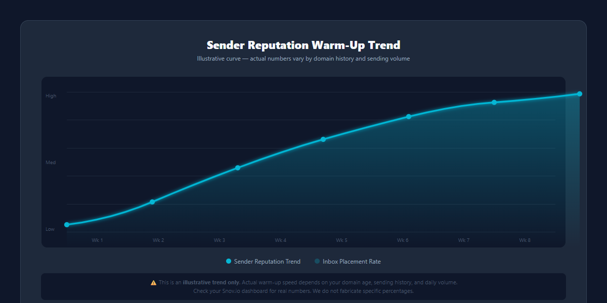
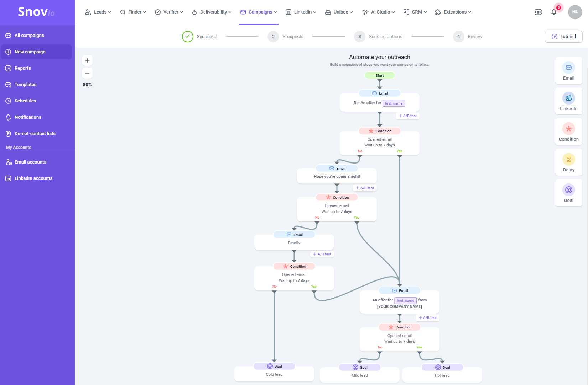
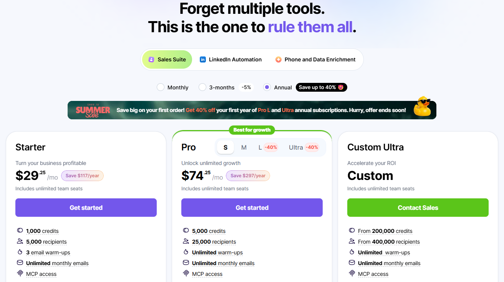
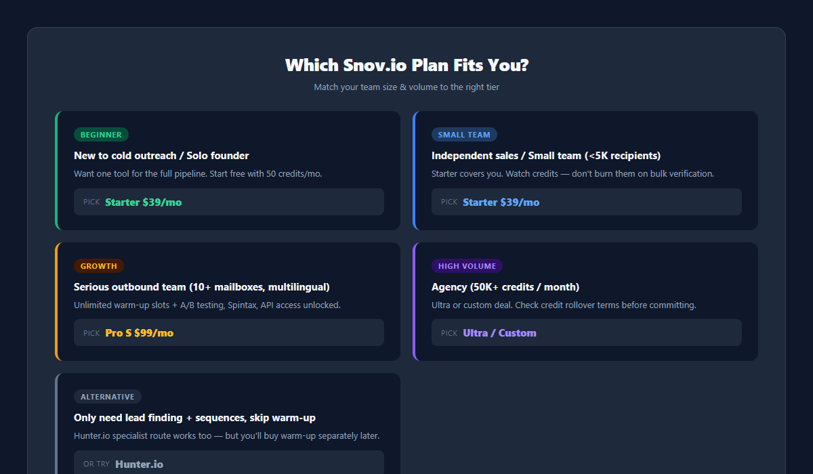

# Snov.io 深度评测：告别"找邮箱 + 预热 + 群发"三件套，一个平台全搞定？

做冷邮件开发，大家习惯拼积木：Hunter 找邮箱、WarmupInbox 养号防封、Woodpecker 跑序列。听着专业，但真上手你就知道多疼——三份订阅轻松破 $200/月，数据在三个后台之间导来导去，域名验证错一个就白搭一晚上。

我们见过太多人死在"配置了三件套，一封像样的序列还没发出去"这一步。

Snov.io 干的事很直接：**把找客户、验邮箱、预热防封、自动序列、客户管理全塞进一个后台**。今天这篇我们把它拆开看——是不是真能替你省下那两笔订阅钱，坑又在哪里。

## 一句话结论

**Snov.io 是目前"一站式冷邮件获客"里性价比最高的选择**：入门 $39/月（年付 $29.25）就同时给你找客 + 验证 + 预热 + 序列 + 免费 CRM，相当于把三件套的钱省掉一大半。它最适合预算有限、不想折腾多工具拼装的外贸/B2B 团队和独立销售。但它有**信用点制**的脾气——高用量用户得想清楚升级路径。

| 项目    | 数值                                    |
| ----- | ------------------------------------- |
| 免费档   | $0，50 credits/月、100 收件人，无需信用卡         |
| 付费起步  | Starter $39/月（年付 $29.25/月）            |
| 中坚档   | Pro S $99/月（年付 $74.25/月，无限预热）         |
| 顶配    | Ultra $738/月（10 万 credits/月）          |
| 评分    | G2 4.6/5（359 评）、Capterra 4.5/5（215 评） |
| 收件人计费 | 首次联系扣 1，同周期跟进免费                       |

<a href="https://snov.io?fp_ref=hu82" target="\_blank" rel="sponsored noopener noreferrer" style="display:inline-block;background:#0f172a;color:#fff;padding:10px 18px;border-radius:8px;font-weight:700;text-decoration:none;margin:8px 0;">🚀 免费试用 Snov.io（50 Credits·无需信用卡）→</a>  
<a href="https://snov.io?fp_ref=hu82" target="\_blank" rel="sponsored noopener noreferrer" style="display:inline-block;background:#0f172a;color:#fff;padding:10px 18px;border-radius:8px;font-weight:700;text-decoration:none;margin:8px 0;">🚀 查看 Snov.io 定价方案 →</a>

## 它到底是什么：All-in-One 冷邮件获客平台

Snov.io 的定位一句话讲完：**一套系统走完"获客 → 验号 → 预热 → 群发 → CRM 跟进"全流程**。目标人群是外贸业务员、B2B 出口企业、增长团队和 Sales Agency。

它管四块业务：

1. **找客户（Email Finder）**——Chrome 插件直接在 LinkedIn / Sales Navigator 页面一键抓联系人邮箱和动态；也能输入公司官网批量挖 CEO、采购经理等决策人邮箱。
2. **邮箱验证（Email Verifier）**——内置，实时剔除无效/废弃邮箱，降低退信率、保域名安全。
3. **自动序列（Drip Campaigns）**——多级分支判断（3 天没打开发 A、打开没回复发 B），支持 AI 写邮件，还能走 LinkedIn 自动化。
4. **免费 CRM**——有意向的回复自动进可视化看板，省掉 HubSpot/Pipedrive 的钱。

## 技术原理：它凭什么又防封又高效

- **Waterfall 多重验证**：实时 SMTP 握手 + 数据库比对双重校验，采集到的邮箱送达率更高，退信率更低。这是它数据质量的核心。
- **同域/多域预热网络（Peer-to-Peer Warmup）**：真人群组 + AI 生成内容互相收发，提升发件箱声誉。Snov.io 的预热池和独立预热工具原理同源，但**打包在订阅里**——这是它比"Hunter + 单独买预热"省钱的关键。

- **动态发件控制**：模拟真实工作时间、随机发送间隔、定制追踪域名，尽量躲开垃圾邮件过滤器。
- **新玩法：MCP 接入**——官方现在支持把 Claude/ChatGPT 等 AI 助手通过 MCP 直接接进账户，在 Snov.io 里干活。这功能对 AI 工作流重度用户是个惊喜。

> 诚实说一句：一体化平台的功能深度，单项上未必打得过"专精工具"。Snov.io 的预热比不过 WarmupInbox 那种 30,000+ 邮箱的纯预热网络，序列比不过 Woodpecker 的条件跟进细腻度。它的赢面是**全流程 + 便宜**——你要的是"够用且省事"，它不是为"极致单点"而生。

## 分项拆解（含真实翻车点）

### 1. 找客与验证（核心强项）

LinkedIn 插件抓取 + 域名批量挖掘 + 内置验证，B2B 场景里这套组合拳够顺手。一个客户经理在 Okisam 的真实案例：一个月收集 80,000+ 线索，单条线索成本降下来了。

**真实翻车点（数据时效）**：第三方评测多次提到数据库部分条目过时——有些人已离职但还在库里。批量抓完**务必过一遍验证**，别直接全量导入。

### 2. 序列与跟进（够用，非极致）

多级分支、AI 写邮件、无限跟进都有。Open 率提升案例很多（Populus Sales CEO 说从 25% 到 73%）。

**多渠道组合拳（Omnichannel）**：Email 序列和 LinkedIn 自动化能并行跑——邮件没回，换 LinkedIn 好友申请/私信跟进，一条线索两种触达。这是"发信工具"和"真获客平台"的分水岭，也是 Snov.io 区别于纯邮件工具的底气。

**真实翻车点（LinkedIn 另付费）**：LinkedIn 自动化**不含在订阅里**，要另买 $69/月/槽。想走 LinkedIn 私信矩阵的话，这笔预算别漏算。

### 3. 免费 CRM（意外之喜）

最多 20 条管道、每条 100 阶段，和 Google 日历同步。作为白送的 CRM 它够用；别拿它跟 HubSpot 比深度，它赢在"原生集成"——序列里的回复直接进看板，不用手动搬运。

### 4. 信用点制（最大的脾气）

1 credit = 1 次线索搜索或邮箱验证。同一个池子，搜索、验证共用——**低套餐很快耗尽**，而且当月未用完的**不结转**（Custom Ultra 除外）。这是被点名最多的槽点：预算要对齐用量，不然月中就卡壳。

**省点小贴士**：批量抓取前先按域名/联系人**去重**，同一个邮箱别搜两遍；抓完再集中验证，别边抓边验。这两个习惯能明显减少重复扣点，低档位用户尤其划算——这是真实用户反馈里最常被提到的省钱做法。

## 价格：到底省不省

| 方案        | 月付   | 年付（/月）  | 点数/月    | 收件人/月   | 预热位 |
| --------- | ---- | ------- | ------- | ------- | --- |
| Trial（免费） | $0   | —       | 50      | 100     | 1   |
| Starter   | $39  | $29.25  | 1,000   | 5,000   | 3   |
| Pro S     | $99  | $74.25  | 5,000   | 25,000  | 无限  |
| Pro M     | $189 | $141.75 | 20,000  | 50,000  | 无限  |
| Pro L     | $369 | $276    | 50,000  | 100,000 | 无限  |
| Ultra     | $738 | $553.50 | 100,000 | 200,000 | 无限  |

年付统一省 25%。所有付费档：无限团队席位、无限活动、无限跟进、无限月发信。收件人按"首次联系扣 1、同周期跟进免费"计。**要点**：Starter 只给 3 个预热位，想给更多邮箱养号就得升 Pro S——这笔升级钱要算进预算。

**动手算一笔账**（三件套价格 2026 年 8 月核实）：

| 方案 | 月成本 | 覆盖范围 |
| --- | --- | --- |
| 传统三件套 | Hunter $49 + WarmupInbox 3 邮箱 $57 + Woodpecker $29 ≈ **$135+** | 找客 / 养号 / 发信，三份订阅、三套后台 |
| Snov.io Starter | **$39** | 找客 + 验证 + 3 预热位 + 无限发信 + 免费 CRM |

同一条冷邮件链路，**$135+ 对 $39**——Snov.io 用一份订阅的钱覆盖了全部环节，这就是它最大的转化点。真到了高用量，Pro S（$99/月）一个顶仨，依然比三件套划算。

## 和 Hunter.io 比：为什么说它更划算

我们拿最经典的竞品 Hunter.io 对照一下（价格 2026 年 8 月核实）：

| 对比维度        | Snov.io                    | Hunter.io            | 谁赢                        |
| ----------- | -------------------------- | -------------------- | ------------------------- |
| 功能完整度       | 找客+验证+预热+序列+CRM+LinkedIn   | 专注找客+验证，预热是付费插件      | **Snov.io**（真 All-in-One） |
| LinkedIn 抓取 | Chrome 插件原生支持              | 已不支持批量抓取             | **Snov.io**               |
| 入门价（同档）     | Starter $39/月，**含 3 个预热位** | Starter $49/月，预热另买插件 | **Snov.io**（更便宜还含预热）      |
| 内置 CRM      | 免费 CRM 全档位                 | 无原生 CRM              | **Snov.io**               |
| 数据准确度       | 欧美+亚洲均衡                    | 欧美中大型企业积累更深          | 打平 / 看行业                  |

**结论**：如果你要的是"找邮箱 + 发序列"，Hunter 的专精度没问题；但只要你碰冷邮件，预热就躲不掉——Hunter 的预热是**加购插件**，Snov.io 是**订阅自带**。单这一点，Snov.io 在预算上就是压倒性的。

## 它在冷邮件链路里的位置（本系列三件套）

我们正在写一个冷邮件系列，三件套逻辑是这样的：

| 链路环节     | 干什么            | 本系列代表工具         |
| -------- | -------------- | --------------- |
| 找线索（获客）  | 挖 ICP、搜集目标客户邮箱 | **Snov.io（本文）** |
| 养号（基础设施） | 预热新邮箱、维护发件声誉   | WarmupInbox     |
| 发信（执行）   | 自动化序列发送、追踪回复   | Woodpecker      |

但 Snov.io 有个特别之处：它**本身就能干后两段的活**（预热 + 序列都内置）。所以它有两种用法：

- **预算只够一个工具** ➔ 直接 Snov.io 全流程，别买三件套；
- **你的发送栈已经定了**（比如团队已有 Woodpecker）➔ Snov.io 单独当"找客 + 验证 + CRM"用也完全成立，模块解耦互不干扰。

想了解链路上另外两环怎么选（纯预热 vs 专业发信），我们同系列的 WarmupInbox 评测（养号）和 Woodpecker 评测（发信）会陆续上线，到时这里会补上直达链接。

<a href="https://snov.io?fp_ref=hu82" target="\_blank" rel="sponsored noopener noreferrer" style="display:inline-block;background:#0f172a;color:#fff;padding:12px 22px;border-radius:8px;font-weight:700;text-decoration:none;margin:10px 0;">🚀 免费试用 Snov.io（50 Credits·无需信用卡）→</a>

## 终极决策树

- **外贸/B2B 新手，想一套跑通全流程** ➔ Snov.io Starter（$39/月），先免费档试 50 credits，确认顺手再升级。
- **独立销售 / 小团队，月收件人 5,000 以内** ➔ Starter 够用，注意点数别浪在验证上。
- **认真做冷邮件的团队（10+ 邮箱、多语言）** ➔ Pro S（$99/月），无限预热位 + 全功能解锁（A/B、Spintax、API）。
- **你是高量级 Agency（月 5 万+ credits）** ➔ 直接看 Ultra 或定制，顺带对比下点数结转条款。
- **只需要找客 + 发序列，不想碰预热** ➔ 那 Hunter 专精路线也行，但记住预热迟早要补。

## 透明度与数据源

本文价格与功能基于 Snov.io 官方定价页（snov.io/pricing）与功能文档，交叉核验 frontdeskreview（2026-06 抓取）、work-management.org、lagrowthmachine、saleshandy 等独立评测的公开数据，核验于 **2026 年 8 月**。评分来自 G2（4.6/5，359 评）与 Capterra（4.5/5，215 评）。价格以官网实时显示为准——官网会调价，年付折扣 25% 为当前标注。我们没有"亲测跑完整个获客流程"，所有结论来自官方文档 + 真实用户反馈的交叉验证，争议点（点数制、LinkedIn 插件另付费、数据时效）已如实标注。

**联盟披露**：本文含联盟链接，你通过它注册，我们可能获得少许佣金，弥补测试成本。这不影响你的价格，也不改变评测口径——上面的缺点都来自真实用户反馈，没动过。

*价格与功能核验于 2026 年 8 月，来源：snov.io/pricing。*

---

**X Thread（引流用，发在 X / Twitter）**

> Snov.io gives you lead finding, email verification, warm-up, drip sequences AND a free CRM in one subscription — $39/mo for all of it. The "Hunter + WarmupInbox + Woodpecker" stack for the same pipeline runs ~$135+/mo. We compared it head to head: Snov.io covers the full flow at less than a third of the cost. Ratings: G2 4.6/5. The catch? A credit pool that burns fast on lower tiers, and LinkedIn automation is a $69/mo add-on. Full review: [your affiliate link]
