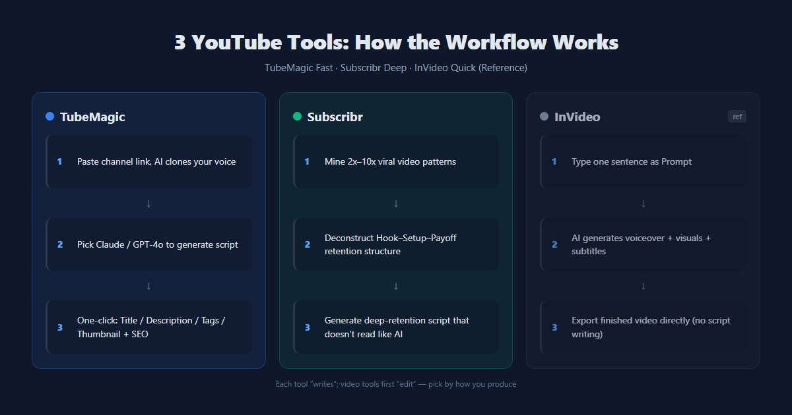
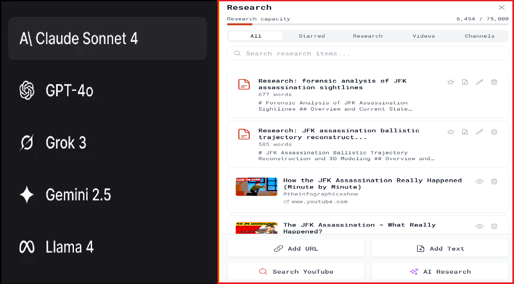
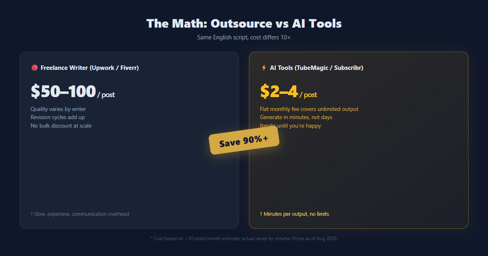
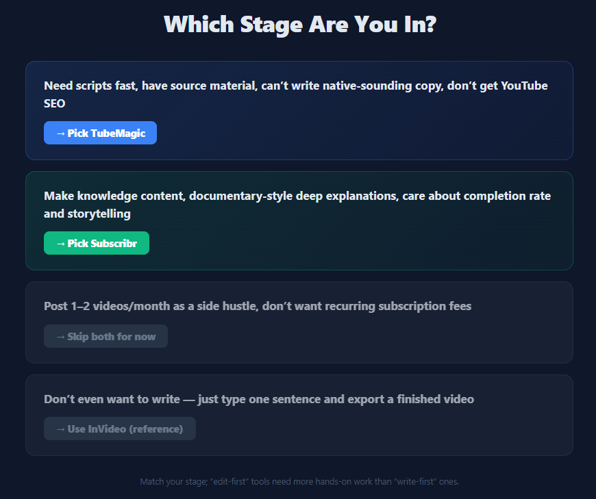

# TubeMagic vs Subscribr：做 YouTube 自动化，脚本工具到底选哪个？

我认识一个做无脸频道（Faceless Channel）的朋友，他的日常是这样：早上打开电脑，看着空白文档发呆四十分钟，最后从以前收藏的视频里扒一段话当脚本。三个月了，频道就 12 个视频，其中 5 个还是同一主题换标题。

后来我们帮他试了两款工具——TubeMagic 和 Subscribr。都不便宜，但都解决了他一半的问题。这篇把两边拆开对比，顺便拿 InVideo 当"一键出片"的参照系。想少走弯路的，看完这页再掏钱。



## 十秒结论（TL;DR）

| 维度   | TubeMagic                | Subscribr          |
| ---- | ------------------------ | ------------------ |
| 起步价  | $47/月（年付 $41/月）          | $299/年（≈$25/月，年付制） |
| 核心强项 | 频道风格克隆 + 一站式 YouTube SEO | 爆款结构拆解 + 完播率导向脚本   |
| 适合谁  | 会剪辑有素材、苦于写稿和 SEO 的创作者    | 做深度长视频、看重故事性和留存的博主 |
| 视频画面 | ❌ 只出脚本和文字                | ❌ 只出脚本和文字          |
| 计费   | 月付/年付任选                  | 仅年付，积分按脚本长度消耗      |

一句话：**TubeMagic 是"快"，Subscribr 是"深"**。两个都是脚本工具，都不是视频生成器——想要输入一句话直接出片，那是 InVideo 的活，放到最后说。

赶时间？直接进工具：

<a href="https://tubemagic.com/ds#aff=toolisme" style="display:inline-block;background:#0f172a;color:#fff;padding:10px 18px;border-radius:8px;font-weight:700;text-decoration:none;margin:10px 0;margin-right:12px;">🚀 试试 TubeMagic →</a>

<a href="https://subscribr.ai?via=hu-liangyu" style="display:inline-block;background:#0f172a;color:#fff;padding:10px 18px;border-radius:8px;font-weight:700;text-decoration:none;margin:10px 0;">🚀 试试 Subscribr →</a>

**TubeMagic 的优点（说实话）**

- 粘频道链接就学你的口吻，不用调 prompt
- 一个订阅全包：脚本、标题、描述、Tags、缩略图、SEO 一把抓
- 不限生成次数（标准模型每日每工具 100 次、高级积分 500/月），多频道共用
- 30 天无理由退款，买错不心疼

**TubeMagic 要注意的**

- 没有免费试用（官方说防垃圾账号），只能先掏钱再退款
- 低频更新者不划算——一个月发 1-2 条，摊到每条 $12+
- AI 稿终归要人工润一遍，不能直接上传

**Subscribr 的优点（说实话）**

- 选题不靠猜：扫描同赛道爆款，把 2x-10x 播放的"离群视频"拆成可套用的结构
- 脚本按完播率设计，钩子、铺垫、收尾是套模板写出来的，读起来不像 AI
- 自带竞品追踪，每周发你一份趋势报告

**Subscribr 要注意的**

- 只按年付，一锁就是一年（$299 或 $747）
- 积分按脚本长度扣：一篇 2000-3200 词的稿子约 6 积分，Creator 档每月 60 积分也就 10-12 篇
- 关键词工具弱，没有搜索量数据，深挖 SEO 还得配 VidIQ 这类

## 谁在背后 + 底层原理

**TubeMagic** 前身是 Morise.ai，创始人 Priyam Raj，就是做给"只关心出内容、不想折腾优化"的 YouTuber 用的。技术上有三件事值得说：一是**风格克隆**——粘你的频道链接，AI 读你过去视频的用词和节奏，出来的稿子是你自己的腔调；二是**多模型切换**——Claude 和 GPT-4o 任选，官方建议 Claude 出稿更自然；三是训练数据——官方说法是拿 10,000+ 爆款钩子结构训练的，目标是高留存脚本。配套的 Warp Upload SEO 会分析你视频的音画线索来生成元数据，据说能提升搜索可见度。

**Subscribr** 的路线完全不同。它先&#x505A;**"离群视频"挖掘**——扫描大量频道，找出播放量高出正常水平 2x-10x 的视频，这些就是你的"蓝本"；然后拆解它们的标题结构、心理钩子、缩略图概念，改写成你赛道的选题；写脚本时按完播率模板（Hook-Setup-Payoff）走，还从你的历史 transcript 里学你的写法。说白了：TubeMagic 教你"怎么写得快"，Subscribr 教你"怎么让人看完"。

## 分项拆解：三个关键维度谁赢

### 1. 脚本质量

我们把同一个主题（一段历史科普）丢给两边，差距在第一句就显出来了：

- **Subscribr 的开场是"藏"**——先抛一个悬念钩子，铺垫慢慢展开，你会想往下看个究竟
- **TubeMagic 的开场是"喊"**——直接开口进入正题，快、利落、不热身

同一个主题，完全是两种手感。我们的体感：**Subscribr 初稿可用度 8-9 成**，尤其长视频，逻辑顺、留白少；**TubeMagic 初稿可用度 7 成**，干净，但有几句话录之前得删。光看开头，你就能听出差别。

**这轮 Subscribr 赢**——前提是你做的是长视频、有时间等。赶量的话，TubeMagic 的速度优势更大。

### 2. 选题与研究

**TubeMagic**：有 Ideas Manager、Niche Explorer、关键词研究、频道命名器。工具齐全，但偏"生成器"——给你一堆点子，挑不挑得中看你自己。OutlierKit 的实测原话是"帮你写漂亮脚本容易，告诉你该拍什么难"。

**Subscribr**：选题是它的主场。离群视频挖掘 + 竞品追踪 + 每周趋势邮件，直接告诉你"这条 10 倍播放的视频为什么爆、你能怎么抄"。Research Assistant 还能喂 PDF、文章、图片进去提炼。

**这轮 Subscribr 赢**——它的研究是"数据驱动"，TubeMagic 是"灵感驱动"。

### 3. SEO 与上传优化

**TubeMagic**：这轮没悬念。标题、描述、Tags、社区贴文、缩略图生成、Warp Upload 全都有，95+ 语言，抄袭检测内置。一套流程走完直接粘贴上传。

**Subscribr**：只有一个"SEO 风格描述"选项，关键词工具没有搜索量数据。官方定位就是"写作优先"，SEO 不是它的菜。

**这轮 TubeMagic 碾压**——这也是为什么不少人是两个都买：Subscribr 写稿，TubeMagic 做 SEO。



## 价格对比（2026 年 8 月核验）

| 项目   | TubeMagic               | Subscribr                        | InVideo（参照）         |
| ---- | ----------------------- | -------------------------------- | ------------------- |
| 起步价  | $47/月 或 $497/年（$41/月）   | Creator $299/年（≈$25/月）           | 免费版带水印（720p 禁商用）    |
| 进阶档  | 无，单档全功能                 | Automation $747/年（≈$62/月）        | Plus ≈$20-28/月（去水印） |
| 计费方式 | 月付/年付任选                 | **仅年付**，$7 试七天                   | 月付/年付               |
| 退款   | 30 天无理由                 | 7 天保证                            | 按平台政策               |
| 生成限制 | 标准模型 100 次/日，高级积分 500/月 | 积分制：Creator 60 积分/月（约 10-12 篇长稿） | 按生成分钟数              |

两个关键点，掏钱前看清楚：

**Subscribr 是年付锁定**。Creator $299、Automation $747，都是一次付一年，没有月付选项。试七天要 $7。这不是坏事——说明它敢让你用真频道测——但你得确定自己一年内持续产出，否则等于白扔。

**TubeMagic 无限生成但无试用**。官方把免费试用砍了（防垃圾账号），给的是 30 天退款。退款门槛很低：30 天内给客服发一封邮件就全额退，支付走 Paddle，流程是标准退款，不会被卡。策略是"先买后测"，月付 $47 起，把第一个月当试用期就行。

> ⚠️ **数据来源说明**：TubeMagic 价格经官网及多个独立评测源交叉核实（2026 年 8 月）；Subscribr 官网定价页为动态渲染，价格按第三方于 2026 年 6 月核实的公开数据（Creator $299 / Automation $747，年付制），**下单前请以官网实时显示为准**。两家都可能随时调价。



## 终极决策树

- **你会剪辑、有素材，就是写不出地道英文脚本 + 搞不懂 YouTube SEO** ➔ **TubeMagic**。粘频道链接出稿，标题描述 Tags 一次搞定，月付灵活，不行 30 天退。
- **你做知识类、纪录片、深度解说，看重完播率和故事性** ➔ **Subscribr**。离群视频挖掘 + 留存结构脚本，稿子像策划过的，不像 AI 拼的。接受年付。
- **你一个月就发一两支视频，当兼职玩玩** ➔ 两个都别买。免费版 TubeMagic 不存在，Subscribr 年付不划算——先用 InVideo 免费额度或 ChatGPT 手工稿撑住。
- **你连剪辑都不想学，想输入一句话直接出片** ➔ 这不是这俩的活。**InVideo** 一键生成配音+画面+字幕，新手无脸频道的最快起跑线。它跟我们评测的脚本工具是两回事，价格参照上表。

对号入座完了？两个入口给你：

<a href="https://tubemagic.com/ds#aff=toolisme" style="display:inline-block;background:#0f172a;color:#fff;padding:12px 22px;border-radius:8px;font-weight:700;text-decoration:none;margin:10px 0;margin-right:12px;">🚀 试试 TubeMagic（30 天退款保障）→</a>

<a href="https://subscribr.ai?via=hu-liangyu" style="display:inline-block;background:#0f172a;color:#fff;padding:12px 22px;border-radius:8px;font-weight:700;text-decoration:none;margin:10px 0;">🚀 试试 Subscribr（$7 试七天）→</a>

## 💡 组合拳：两个都买的人，其实是在这么用

> 我们问了几位同时在用两家的创作者，工作流惊人地一致：
>
> 1. **Subscribr 找选题、写深度稿**——离群视频告诉你该做什么，留存结构保证有人看完
> 2. **稿子丢进 TubeMagic 润色 + 生成 SEO**——克隆你频道口吻过一遍，标题描述 Tags 直接能粘贴
> 3. *（可选）* **最终稿喂给 InVideo**——素材配音字幕自动匹配，直接出片
>
> 三个工具覆盖"选题→写作→出片"三段，各干各擅长的。预算紧就先买一个，按上面决策树对号入座。



## 我们怎么写这篇（透明说明）

我们未付费订阅评测这两款工具的全部功能，结论基于：官网功能与定价页、TubeMagic 与 Subscribr 的官方创作者背书（Matt Par、AI Guy、Randolph 等）、第三方独立评测（OutlierKit、Websites2Know、Product Insight AI、Toolradar 等）及社区反馈，核验于 2026 年 8 月。负面反馈均来自真实用户评论并作缓和处理。价格随时会变，下单前以官网为准。

## 联盟披露

本文含联盟链接。你通过链接购买，我们可能获得佣金。这不影响我们的评测、评分或所说的话。我们只写自己会用的工具。

---

*资料来源：tubemagic.com、subscribr.ai 官网；OutlierKit、Websites2Know、Product Insight AI、Toolradar、AITool Review 等独立评测（2026 年 6-8 月核验）。*

## X Thread（引流用，发在 X / Twitter）

```
Two AI tools write your YouTube scripts. One is fast, one is deep.

We compared TubeMagic vs Subscribr:

- TubeMagic: clones your channel voice, bundles SEO. $47/mo, monthly or yearly.
- Subscribr: digs up outlier videos, writes retention-first scripts. $299/yr, annual only.
- Both are script tools. Neither makes the video.

Pick by how you create:
→ Edit your own footage? TubeMagic.
→ Long-form, retention-obsessed? Subscribr.

Full breakdown 👇
[your affiliate link]
```
