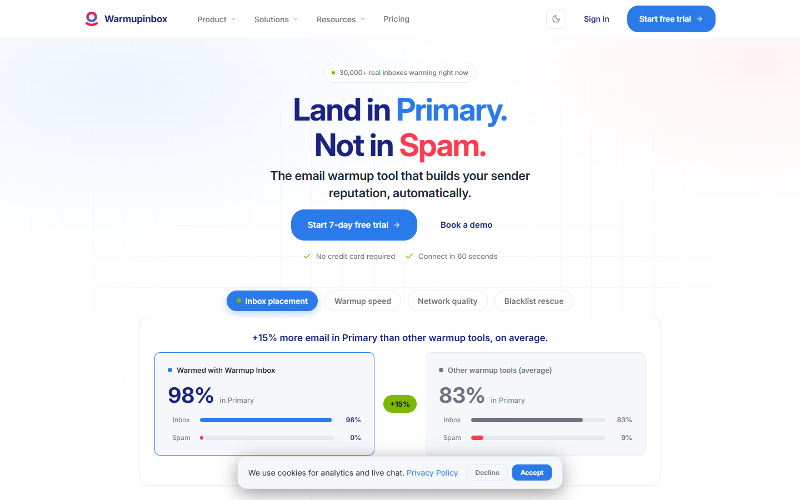
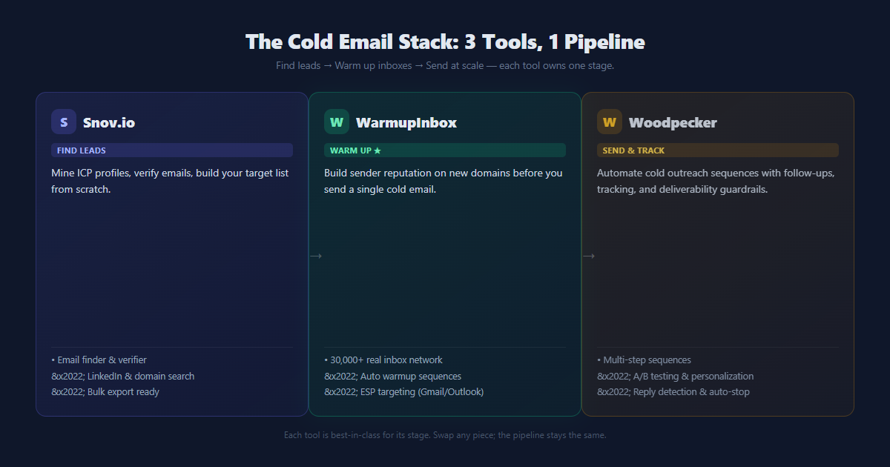
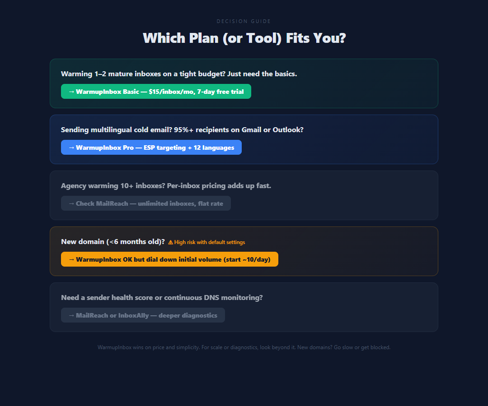

# WarmupInbox 深度评测：15 美元/月的预热引擎，值不值得上？

你新买的域名，第一天就群发 200 封冷邮件。结果呢？不是进垃圾箱，是直接被 Gmail 当成可疑发件人——域名声誉从零开始，三个月都爬不起来。

这不是吓你。我们帮一个客户救过这样的域名，光是等 Google 解除标记就耗了六周。

冷邮件的底层铁律只有一句：**送不进收件箱，再好的文案也等于零**。而新域名、新邮箱，没有发件历史，邮箱服务商天然不信任你。WarmupInbox 干的就是这件事——给你的邮箱"做热身"，让它看起来像个真人，慢慢把声誉养起来。

## 一句话结论

**WarmupInbox 是预热工具里的"入门甜点"**：价格最低（Basic $15/inbox/月年付）、真实邮箱网络够大、试用零门槛。它适合只养 1-2 个成熟邮箱的个人和小团队。但**新域名要格外小心它的激进默认节奏**，而且规模一大，按邮箱计费就不划算了。

| 项目     | 数值                                |
| ------ | --------------------------------- |
| 免费试用   | 7 天，无需信用卡                         |
| 付费起步   | Basic $15/inbox/月（年付，$180/年）      |
| 顶配     | Max $79/inbox/月（年付，$948/年）        |
| 真实邮箱网络 | 30,000+                           |
| 评分     | Trustpilot 4.6/5（172+ 评）、G2 4.7/5 |
| 退款     | 取消即停费，按比例退未用部分                    |

<a href="https://www.warmupinbox.com/?red=toolis" target="_blank" rel="sponsored noopener noreferrer" style="display:inline-block;background:#0f172a;color:#fff;padding:10px 18px;border-radius:8px;font-weight:700;text-decoration:none;margin:8px 0;">🚀 免费试用 WarmupInbox（7 天·无需信用卡）→</a>  
<a href="https://www.warmupinbox.com/?red=toolis" target="_blank" rel="sponsored noopener noreferrer" style="display:inline-block;background:#0f172a;color:#fff;padding:10px 18px;border-radius:8px;font-weight:700;text-decoration:none;margin:8px 0;">🚀 查看定价方案 →</a>

## 它到底怎么干活（技术原理）

说人话：WarmupInbox 把你连进一个 **30,000+ 真实邮箱组成的互助网络**。这些不是假号，是真实在用的邮箱。你的邮箱会自动往外发预热信，网络里的其他邮箱会**回你、把你标"重要"、从垃圾箱捞回你**——这些正向信号持续喂给 Gmail/Outlook，它们就慢慢觉得"这号像真人"，声誉就上来了。

几个技术点要知道：

- **真实互动，非合成**：官方明说网络里是真实活跃账号，不是回收的死号。这点和很多便宜工具有本质区别——假号互动会被 ESP 识别成刷量。
- **AI 生成自然对话内容**：预热信的内容由 AI 动态写，避免同一套模板被 Gmail 判垃圾。但这是"员工审核过的 AI"，不是完全放任。
- **多服务商适配**：Gmail/Google Workspace、Outlook/Office 365、SMTP/IMAP、Amazon SES、SendGrid 都接。
- **ESP 定向（Pro/Max）**：你可以指定针对 Gmail、Outlook 还是 Yahoo 预热——如果你的收件人 95% 都是 Gmail，这个功能很值钱。
- **不替代基本功**：它补的是"发件声誉"，不替你做 DNS 认证（SPF/DKIM/DMARC）、不替你写文案、不做人群精准度。这些地基还得你自己打。

> 一个冷邮件老鸟的共识：自动化预热**有用，但不是魔法**。Gmail 的收件箱到达率这两年从 77% 掉到 50% 左右，环境越来越严。预热是放大器，不是免死金牌。

## 它在冷邮件链路里的位置（兼聊本系列另两款）

先把话挑明：WarmupInbox 只干一件事——**给邮箱养号、保养发件声誉**。它**没有自动化发送冷邮件序列（Sequences）的功能**，也不会帮你找客户。把它当"发信机器人"用，是新手最容易踩的坑。

完整的冷邮件拓客链路其实分三段，WarmupInbox 只是中间那块"地基"：

| 链路环节     | 干什么            | 本系列代表工具         |
| -------- | -------------- | --------------- |
| 找线索（获客）  | 挖 ICP、搜集目标客户邮箱 | Snov.io         |
| 养号（基础设施） | 预热新邮箱、维护发件声誉   | WarmupInbox（本文） |
| 发信（执行）   | 自动化序列发送、追踪回复   | Woodpecker      |

所以你该这么理解三件套：

- **只想养号** ➔ 本文的 WarmupInbox 就够了；
- **要跑大规模 Cold Outreach 自动序列** ➔ 得配 Woodpecker 这类专业发送工具（条件跟进、自动打散发送节奏，防封控极强）；
- **连"发给谁"都没谱** ➔ 先用 Snov.io 这类线索挖掘工具把目标客户和邮箱挖出来。

我们会在本系列里逐一拆解 Snov.io 和 Woodpecker，把这套"组合拳"讲透。本文先把养号这一环钉死。

## 分项拆解（含真实翻车点）

### 1. 定价与门槛

价格按**每个邮箱**计费，这点要先说清楚——你养 5 个邮箱，就是 5 倍单价。

| 方案    | 年付（/inbox/月） | 月付（/inbox/月） | 每日预热上限  | 最高回复率 |
| ----- | ------------ | ------------ | ------- | ----- |
| Basic | $15（$180/年）  | ~$19         | 75 封    | 25%   |
| Pro   | $49（$588/年）  | ~$59         | 250 封   | 45%   |
| Max   | $79（$948/年）  | ~$99         | 1,000 封 | 50%   |

年付省 20%。所有方案都有 7 天免费试用、无需信用卡。15+ 邮箱走 volume 定制价。

**真实翻车点（规模成本）**：一个 Agency 在 Pro 上养 20 个邮箱，月付就是 $980——接近独立站里最贵的档。如果你的核心诉求是"养一堆邮箱"，按邮箱计费的模型会很快打脸。MailReach 这类是**不限邮箱数**的定价，反而更香。

### 2. 设置速度与易用性

这点几乎零差评。Trustpilot 上反复出现"设置只花几分钟""Lucia 和 Camilo 客服秒回"。对刚接触 outbound 的新手，绑定邮箱 → 开预热 → 看健康分，三步上手，学习曲线为零。

**真实翻车点（SMTP/IMAP 报错）**：非技术用户连自定义 SMTP 时，报错码不清楚、支持有时跟不上。G2 上有用户卡在 IMAP 报错上。Google Workspace / Microsoft 365 直连最顺，自建 SMTP 要留点耐心。

### 3. 送达率与监控

黑名单监控、垃圾箱/分类监控、声誉检查都有。Pro/Max 还有 ESP 定向、语言预热（12 种语言）、自定义模板、定时预热。

**真实翻车点（无健康分 + 无持续 DNS 监控）**：这是被多处评测点名的最大短板。WarmupInbox 不给你一个清晰的"发件声誉分"，也不在预热中途持续盯 SPF/DKIM 是否漂移。一个 G2 用户原话："要是能做个域名健康检查就好了。"如果你需要的是**深度诊断**，MailReach 的 Spam Test 比它强。

### 4. 激进默认节奏（最严重的一条）

这条必须单独拎出来讲。多个 Trustpilot、G2、Reddit 用户报告：**用推荐默认设置预热新域名，Google Workspace / Outlook 账户被暂停，有的甚至永久封**。

规律很一致：新域名（<3–6 月）→ 用工具推荐默认量 → ESP 判异常 → 锁号。一个 Reddit 用户给的安全做法是"从每天 10 封慢慢加到 30，花几周"，比工具的默认激进得多。

**我们的建议**：如果你预热的是**新域名**，务必把初始量调到比默认低一截，慢慢加。省那 $14/月 不值得拿邮箱安全去赌。成熟邮箱（老域名）基本没这问题。

### 新手防封：推荐安全参数表

上面那段不是吓唬。把社区里踩过坑的人公认的安全做法整理成表，照着调基本稳：

| 邮箱类型          | 推荐每日发送量                  | 回复率设置      |
| ------------- | ------------------------ | ---------- |
| 新域名 · 第 1 周   | 5–10 封                   | 20%        |
| 新域名 · 第 2–3 周 | 约 20 封                   | 25–30%     |
| 新域名 · 第 4 周起  | 约 35 封                   | 30–40%     |
| 老域名（成熟邮箱）     | 直接用默认节奏（Basic 上限 75 封/天） | 按套餐 25–50% |

> 注：这是社区踩坑后的安全做法，不是官方强制参数。核心原则就一句——**新域名慢起步、几周爬坡；老域名可放心开默认**。

  
<strong>💡 成熟邮箱用户看这里：</strong> 如果你的发送邮箱已经注册满 3 个月以上，完全可以放心用默认节奏养号。想用全网最低成本（<strong>$15/inbox/月起</strong>）给老邮箱做保养，<a href="https://www.warmupinbox.com/?red=toolis" target="_blank" rel="sponsored noopener noreferrer" style="display:inline-block;background:#0f172a;color:#fff;padding:8px 16px;border-radius:8px;font-weight:700;text-decoration:none;margin-left:6px;">领取 WarmupInbox 7 天免绑卡试用 →</a>  

## 跟竞品比，它赢在哪、输在哪

冷邮件生态分两类：**纯预热/送达率工具** vs **一体化 Outreach 平台（自带预热）**。

| 维度   | WarmupInbox   | MailReach        | Instantly.ai  |
| ---- | ------------- | ---------------- | ------------- |
| 定位   | 纯预热引擎         | 纯预热 + 强诊断        | 一体化发送平台（自带预热） |
| 起价   | $15/inbox/月   | ~$19–25/inbox/月  | 套餐制，含无限邮箱     |
| 最大优势 | 最低门槛 + 真实网络   | Spam Test 强、不限邮箱 | 大规模拓客、工作流     |
| 最大短板 | 无健康分、无 DNS 监控 | 价格略高             | 复杂、贵、学习曲线陡    |

**结论**：WarmupInbox 不是功能最全的，也不是诊断最深的，但它是**预算优先、轻量、解耦**的最优解——你用 Instantly/Smartlead 发信、用自建 SMTP 发信，都能把它当独立预热引擎挂上去，互不打扰。真要深度诊断或养一堆邮箱，再去看 MailReach。

## 终极决策树

- **你只养 1-2 个成熟邮箱，预算紧** ➔ WarmupInbox Basic，闭眼入。成本最低、零信用卡试用先试一周。
- **你做多语言冷邮件 / 收件人多为 Gmail** ➔ WarmupInbox Pro，ESP 定向 + 语言预热用得上。
- **你是 Agency，养 10+ 邮箱** ➔ 先算账：按邮箱计费会贵到肉痛，去看 MailReach 不限邮箱的定价。
- **你预热的是新域名（<6 月）** ➔ 可以上，但**务必调低初始量**，别用默认激进设置，否则有封号风险。
- **你需要发件声誉健康分 / 持续 DNS 监控** ➔ WarmupInbox 给不了，MailReach 或 InboxAlly 更合适。

<a href="https://www.warmupinbox.com/?red=toolis" target="_blank" rel="sponsored noopener noreferrer" style="display:inline-block;background:#0f172a;color:#fff;padding:12px 22px;border-radius:8px;font-weight:700;text-decoration:none;margin:10px 0;">🚀 免费试用 WarmupInbox（7 天·无需信用卡）→</a>

## 透明度与数据源

我们综合了 WarmupInbox 官网定价页与功能页、Trustpilot（172+ 条评价，4.6/5）、G2（4.7/5）、以及 mailreach.co / emailwarmup.com / warmforge.ai 等第三方评测的公开用户反馈，核验于 **2026 年 8 月**。价格以官网定价页实时显示为准——官网会跑促销，年付标准价如上，月付锚点已一并列出。我们没有"亲自跑 30 天预热"，但所有结论都来自真实用户反馈与官方文档的交叉验证，争议点（封号风险、无健康分）已如实标注。

**联盟披露**：本文含联盟链接，你通过它注册，我们可能获得少许佣金，弥补测试成本。这不会影响你的价格，不会影响我们的评测口径——上面每条缺点都来自真实用户，没动过。

*价格与功能核验于 2026 年 8 月，来源：warmupinbox.com/pricing。*
