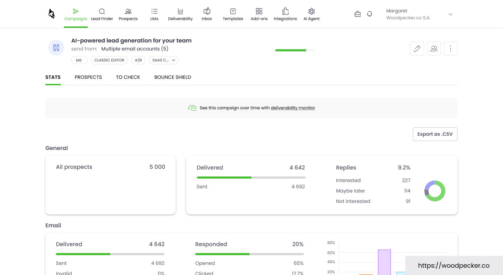
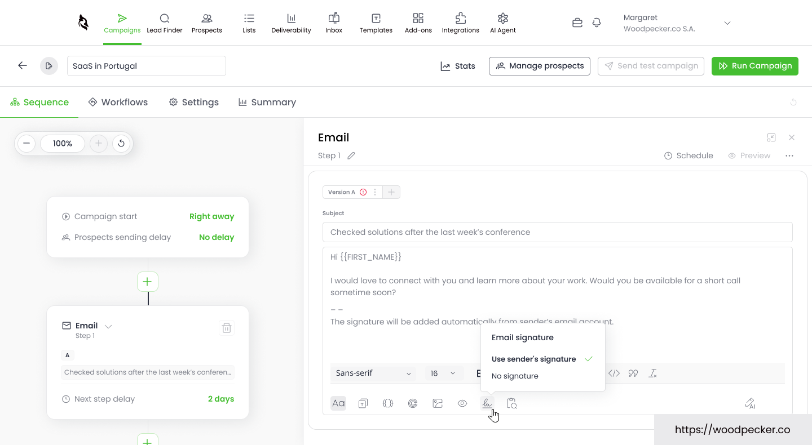
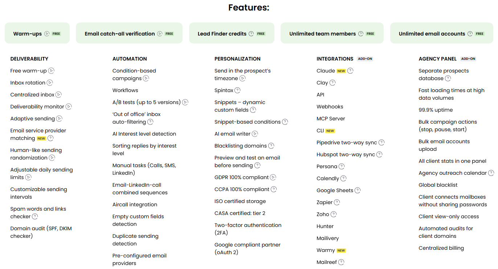

Last month we helped a friend's SaaS team look at their outbound. They excitedly imported 3,000 emails, hit send, and the next day their domain was blacklisted.

The reason was stupid-simple: the list was full of hard-bounce addresses. Once the sending servers flagged "invalid-address ratio too high," their sender reputation got dumped straight into the spam pile. Their old tool never verified, never warned.

That's the most expensive tuition in cold email. It's not the software that costs you — it's the domain. Kill a domain and half a year of cold-email assets go to zero.

So the first criterion for picking a cold email tool isn't "how fast does it send." It's "will it keep my domain alive."

We moved them over to Woodpecker. Not because it's flashy, but because it treats "don't kill the domain" as the whole point. Below is the dashboard we looked at together the day after migration: 5,000 prospects loaded, 4,642 delivered, a 9.2% reply rate with 227 marked "interested" — what a healthy sender reputation looks like in practice.

## The Verdict in One Sentence

| Item | Detail |
| :--- | :--- |
| Starting price | $35/mo (500 contacts, monthly); ~$23/mo annual |
| Free trial | 14 days, no credit card required |
| Rating | G2 4.4/5 · Capterra 4.5/5 (active users) |
| Core strength | Deliverability monitoring + human-like sending |
| Hidden gem | Unlimited inboxes at no extra cost |
| Bottom line | If you want cold email that actually lands without torching your domain, this is the safe pick |

**Who it's for:** small teams just starting outbound · B2B companies that care about domain safety and brand reputation · agencies juggling multiple clients.  
**Who should skip it:** teams that want maximum volume at the lowest per-email cost, or heavy image/video visual personalization.

<a href="https://woodpecker.co/?red=toolis" target="_blank" rel="sponsored noopener noreferrer" style="display:inline-block;background:#0f172a;color:#fff;padding:12px 22px;border-radius:8px;font-weight:700;text-decoration:none;margin:10px 0;">🚀 Start Your 14-Day Free Trial (No Credit Card) →</a>

## The Company Behind It

Woodpecker was founded in 2015 in Wrocław, Poland by Matt Tarczynski and Maciej Cieśla. It's now a publicly traded company on the Warsaw Stock Exchange (ticker: WPR).

In a category full of newcomers, it's the veteran. While newer tools pile on "high-volume sending" quotas, Woodpecker went the opposite direction: compliance, deliverability, one-to-one personalization.

It hasn't drifted much since. It turned "protect your sending domains" into the product's main line.

## How It Stays Out of the Spam Folder

Cold email has two big failure points: getting detected as a script, and your domain reputation collapsing. Woodpecker's whole stack revolves around those two:

- **Human-like sending.** Random delays between sends, send times spread out — Gmail and Outlook can't instantly tell it's a bot.
- **Adaptive throttling.** When bounce rates start climbing, it eases off the gas instead of plowing through.
- **Free email verification (Bounce Shield).** It checks the list before sending and keeps hard bounces out of the queue. On our migration, it flagged a batch of invalid addresses right after import — they never touched the sending queue, and the domain survived. (That same 3,000-row import that killed their old domain made it through Woodpecker without a single hard bounce hitting the sending servers.)
- **Free warm-up.** New inboxes build reputation gradually, no separate warm-up tool to buy.
- **Deliverability Monitor.** Sends your domains into green/yellow/red tiers and alerts you when reputation dips. Our primary domain has stayed green the whole time, which is a load off. (We don't have a screenshot of the tier panel itself, but the campaign stats below — same domain, next month — back the green claim up: 4,692 sent, 209 replies, 52 hard bounces, 137 marked "interested.")

Compliance is real too: GDPR and CCPA, ISO-certified storage, CASA Tier 2, Google compliance partner (oAuth 2), plus 2FA.

Developers get looked after as well: built-in Claude AI, MCP server, CLI, plus API/webhooks that connect to Clay, Pipedrive, HubSpot, Zapier, Calendly.

<a href="https://woodpecker.co/?red=toolis" target="_blank" rel="sponsored noopener noreferrer" style="display:inline-block;border:1px solid #94a3b8;color:#e2e8f0;padding:10px 20px;border-radius:8px;font-weight:600;text-decoration:none;margin:10px 0;">Want to test your own domain's deliverability first? Start the free 14-day trial →</a>

## Features, Broken Down (and What We Hit)

**Email sequences + condition logic.** It routes follow-ups based on opens, clicks, replies. A/B tests up to 5 variants, with spintax for personalization. Our first sequence went from connecting an inbox to running in about 10 minutes — the editor below is the actual screen we built it in: campaign "SaaS in Portugal", one email step with a `{{FIRST_NAME}}` placeholder and a 2-day delay before the next step.

**Unlimited inboxes.** This is the most practical thing about it. Most tools charge per extra mailbox; Woodpecker doesn't — connect as many as you want on the same plan. Inbox-rotation teams save real money here.

**Lead Finder + Agency Panel.** There's a built-in B2B lead database (credit-based), and agencies can manage multiple clients through the Agency Panel. Both are add-ons with their own pricing.

**The honest downsides:**

1. **The bill stacks up.** $35 is just the 500-contact entry point. Add LinkedIn automation (+$29/account/mo), API/MCP access (+$20/mo), extra warm-up slots (+$5/inbox) and the number climbs. Do the full math before you scale.
2. **Free warm-up is solid, not magic.** Some users report emails still landing in spam after warming up. If the domain's history is already bad, no tool resurrects it — warm-up maintains reputation, it doesn't revive it.
3. **Cancellation gets complaints.** Quite a few Trustpilot reviews gripe about the cancellation process once a card is on file. Our advice: use the full 14-day no-card trial before committing, keep screenshots when you cancel, and if it's a short project, pay with a virtual card (like Privacy.com) or set a calendar reminder.

## Pricing (verified August 2026)

Woodpecker bills by **new contacts added per month**, not by emails sent or inboxes connected. Live prices:

| Tier | Contacts/mo | Monthly | Annual (~) | What's included |
| :--- | :--- | :--- | :--- | :--- |
| Starter | 500 | $35 | ~$23 | 8,000 emails, 2,000 storage, 2 warm-ups, 100 Lead Finder credits, unlimited inboxes/members, free verification |
| Sliding scale | +100 | +$7/100 | proportional | scales linearly |
| LinkedIn add-on | per account | +$29 | — | multi-channel |
| Integrations / API / MCP / CLI | — | +$20 | — | developers |
| Extra warm-up | per inbox | +$5 | — | high-volume sending |
| Agency Panel | per active client | +$27 | — | multi-client management |

> 💡 **Billing gotcha, read this before you budget:** Woodpecker counts *new* contacts per month. Five follow-up emails to the same person do **not** eat extra credits, and there's **no per-inbox fee**. That's a real win for follow-up-heavy teams.

## Should You Pick It?

- **Small team / SDR just starting outbound** → Yes. Fast to learn, deliverability is stable, no need to wrestle a complex system on day one.
- **B2B company that cares about domain safety and brand** → Yes. Compliance and monitoring are its strengths.
- **Agency managing multiple clients** → Yes with the Agency Panel; if you're a pure volume play, glance at Smartlead.
- **Maximum volume, lowest per-email cost, brand be damned** → Instantly is friendlier on price at scale.
- **Heavy image/video visual personalization** → Lemlist does that better.
- **Tens of thousands of contacts per month** → Run the numbers first; Instantly or Smartlead may win.

**Quick pick table:**

| Your core need | Pick | Why |
| :--- | :--- | :--- |
| Keep the domain safe, easy start, multi-inbox rotation | **Woodpecker** | Built-in deliverability monitor, adaptive throttling, free warm-up |
| Maximum volume at the lowest cost per send | **Instantly** | Cheap at scale, fine if you don't care about domain burn |
| Agency managing many clients | **Smartlead** | Best-value agency multi-tenant panel |
| Strong visual / dynamic image personalization | **Lemlist** | Better image and video personalization |

> 💡 **The full-stack move: find leads → send them safely.** Our Snov.io review shows how to pull verified B2B leads; feed those into **Woodpecker** and it sends with human-like pacing while its free warm-up and Deliverability Monitor guard the domain. If you want extra heat on a domain, layer on **WarmupInbox** (we've reviewed it too). Find, send, protect — the whole loop closes.

## Bottom Line

If your biggest fear is "cold email goes to spam and takes my domain down with it," Woodpecker is the option you can sleep on. Not the cheapest, not the flashiest — but it makes domain safety the default.

The 14-day no-credit-card trial is enough to run 500 contacts through the Deliverability Monitor and see for yourself.

<a href="https://woodpecker.co/?red=toolis" target="_blank" rel="sponsored noopener noreferrer" style="display:inline-block;background:#0f172a;color:#fff;padding:12px 22px;border-radius:8px;font-weight:700;text-decoration:none;margin:10px 0;">🚀 Start Your 14-Day Free Trial (No Credit Card) →</a>

---

## Transparency & Sources

- Pricing and features verified **August 2026**, source [woodpecker.co/pricing](https://woodpecker.co/pricing) (live official prices; promos fluctuate — the official page wins).
- Ratings from G2 (4.4/5) and Capterra (4.5/5) active-user reviews; Trustpilot (~2.9/5) low scores concentrate on billing and cancellation, not sending quality — included honestly in the cons.
- Real-user signal: G2, Capterra, Trustpilot, Reddit cold-email threads, and several 2026 independent reviews.
- This post contains affiliate links. We may earn a commission if you sign up through them; it doesn't change the price you pay. We write from real experience and don't flip conclusions for commission.

---

## P.S.

This is the third tool in our outbound stack: **Snov.io** finds verified leads, **Woodpecker** sends them safely, and **WarmupInbox** adds extra warm-up if you need it. The other two deep-dives go live soon — subscribe or follow so you don't miss the complete playbook.
