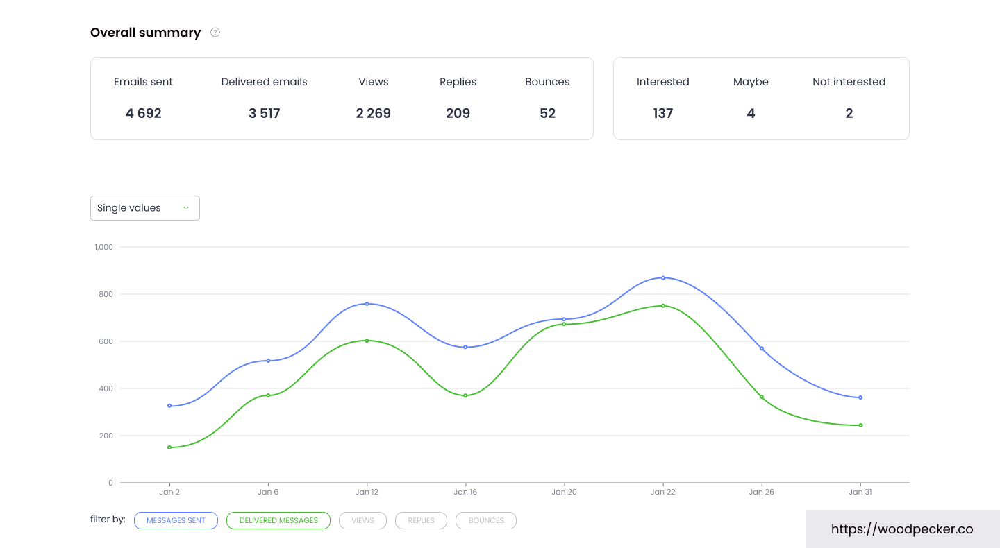

上个月我们帮一个做 SaaS 的朋友看他的 outbound。他兴冲冲导入 3000 个邮箱，点下发送，第二天域名进了黑名单。

原因很蠢：清单里混了一堆硬退信地址。发送服务器一判定"无效地址占比过高"，直接把他的发信信誉打进垃圾区。他之前用的工具不校验、也不预警。

这就是冷邮件最贵的学费。不是软件贵，是域名废了。废一个域名，你攒了半年的冷邮件资产全清零。

后来我们把他迁到 Woodpecker。不是因为它花哨，是因为它把"别把域名搞死"当成了头等大事。

## 一眼看完（TL;DR）

| 项目    | 情况                              |
| :---- | :------------------------------ |
| 起步价   | $35/月（500 联系人，月付）；年付约 $23/月     |
| 免费试用  | 14 天，免信用卡                       |
| 评分    | G2 4.4/5 · Capterra 4.5/5（活跃用户） |
| 核心卖点  | 送达率监控 + 模拟真人发送                  |
| 隐藏亮点  | 无限邮箱绑定，不另收费                     |
| 一句话结论 | 想让冷邮件"发得出去、不毁域名"，它是稳妥那一个        |

**适合谁：** 刚做 outbound 的小团队 · 怕域名被标记、注重品牌安全的 B2B 公司 · 管多客户的代运营。  
**不适合谁：** 要海量群发把单封成本压到极低、或要超强图片/视频视觉个性化的团队。

<a href="https://woodpecker.co/?red=toolis" target="\_blank" rel="sponsored noopener noreferrer" style="display:inline-block;background:#0f172a;color:#fff;padding:12px 22px;border-radius:8px;font-weight:700;text-decoration:none;margin:10px 0;">🚀 免费试用 Woodpecker（14 天，免信用卡）→</a>

## 这家公司什么来头

Woodpecker 2015 年在波兰弗罗茨瓦夫成立，创始人 Matt Tarczynski 和 Maciej Cieśla。它现在是华沙证券交易所上市公司（代码 WPR）。

冷邮件这行里，它是老资格。同期很多新工具拼命堆"高配额群发"，Woodpecker 走的是另一条路：合规、送达率、一对一个性化。

这些年它没怎么改方向。反而把"保护发信域名"做成了产品主线。

## 它怎么做到"不进垃圾箱"

冷邮件最大的坑就两个：被识别成脚本，以及域名信誉掉下去。Woodpecker 的技术围着这两件事转：

- **模拟真人发送。** 发送间隔带随机延迟，发送时间打散，不让 Gmail、Outlook 一眼看出是机器人。
- **自适应限速。** 一旦退信率抬头，它自动收油门，不硬冲。
- **免费邮箱校验（Bounce Shield）。** 发送前先过一遍，把硬退信地址拦在队列外。我们那次迁移，导入清单后它直接标出一批无效地址——没让它们进发送队列，域名才保住。
- **免费预热。** 新邮箱逐步养信誉，不用另买预热工具。
- **送达率监控（Deliverability Monitor）。** 把你的发信域名分成绿/黄/红三档，信誉往下掉会提醒你。我们主域名一直停在绿区，心里踏实。

合规也不含糊：GDPR、CCPA 双合规，ISO 认证存储，CASA Tier 2，还是 Google 合规合作伙伴（oAuth 2 授权），带 2FA。

开发者这边也跟上了：内置 Claude AI、MCP Server、CLI，外加 API/Webhooks，能和 Clay、Pipedrive、HubSpot、Zapier、Calendly 打通。

## 功能拆开看，以及我们踩到的点

**邮件序列 + 条件分支。** 能按"打开 / 点击 / 回复"自动走不同后续。A/B 测试最多 5 版，配合 spintax 做个性化。我们第一条序列从绑邮箱到跑通，大约 10 来分钟。

**无限邮箱绑定。** 这是它最实在的点。很多工具多绑一个邮箱就加钱，Woodpecker 同一套餐下绑多少个都不另收。做 inbox rotation 的团队省一笔。

**Lead Finder + Agency Panel。** 自带 B2B 线索库（积分制），代运营能用 Agency Panel 管多客户。但这两个是附加组件，要单算钱。

**翻车点，老实说：**

1. **账单会叠。** $35 只是 500 联系人的起步。要开 LinkedIn 自动化（+$29/账号/月）、API/MCP 集成（+$20/月）、多域名预热（+$5/个），账单往上走不奇怪。量大前先算总账。
2. **免费预热稳，但不是魔法。** 有用户反馈预热完仍有邮件落垃圾箱。域名底子本来就差的，工具救不回——预热是养护，不是起死回生。
3. **退订流程被吐槽。** Trustpilot 上不少投诉集中在"取消麻烦、绑了卡难脱身"。我们建议：先用满 14 天免卡试用确认，再绑卡；取消时留好截图。

## 定价（核实于 2026 年 8 月）

Woodpecker 按"每月联系的联系人"计费，不是按邮件数或邮箱数。官网实时价：

| 档位                   | 联系人/月  | 月付     | 年付（约） | 含什么                                                  |
| :------------------- | :----- | :----- | :---- | :--------------------------------------------------- |
| 起步                   | 500    | $35    | ~$24  | 8000 邮件、2000 存储、2 预热、100 Lead Finder 积分、无限邮箱/成员、校验免费 |
| 按需滑动                 | 每 +100 | $7/100 | 同比例   | 线性加量                                                 |
| LinkedIn 外接          | 每账号    | +$29   | —     | 多通道                                                  |
| 集成 / API / MCP / CLI | —      | +$20   | —     | 开发者                                                  |
| 额外预热                 | 每邮箱    | +$5    | —     | 高量发送                                                 |
| Agency Panel         | 每活跃客户  | +$27   | —     | 多客户管理                                                |

## 你该不该选它

- **刚起步做 outbound 的小团队 / SDR** → 选它。上手快、送达率稳，犯不着一上来就折腾复杂系统。
- **注重域名安全、品牌名誉的 B2B 公司** → 选它。合规和监控是它强项。
- **代运营管多客户** → 选它 + Agency Panel；纯拼量价的大 Agency 可以顺手看看 Smartlead。
- **要海量群发、把单封成本压到最低、不在乎品牌** → Instantly 量价更友好。
- **要超强图片/视频视觉个性化** → Lemlist 更拿手。
- **量大到几万联系人/月** → 先算账，Instantly / Smartlead 可能更划算。

> 💡 **独家高阶玩法：找客 → 发送一条龙**  
> 我们评测过的 **Snov.io** 先把已验证的 B2B 线索捞出来，导进 **Woodpecker** 用模拟真人节奏发出去，靠它自带的免费预热 + 送达率监控守住域名。Woodpecker 自带预热大多数团队够用；想给域名额外加温，可以再叠我们评测过的 **WarmupInbox**。三件套凑齐，outbound 从找人到点开就闭环了。

## 结论

如果你最怕的是"冷邮件发出去进垃圾箱、还把域名搞废"，Woodpecker 是那个让人睡得着觉的选择。它不最便宜、不最花哨，但它把域名安全做成了默认项。

14 天免信用卡试用，先跑 500 个联系人感受一下送达率监控再说。

<a href="https://woodpecker.co/?red=toolis" target="\_blank" rel="sponsored noopener noreferrer" style="display:inline-block;background:#0f172a;color:#fff;padding:12px 22px;border-radius:8px;font-weight:700;text-decoration:none;margin:10px 0;">🚀 免费试用 Woodpecker（14 天，免信用卡）→</a>

---

## 透明度与数据源

- 定价与功能核实于 **2026 年 8 月**，来源 [woodpecker.co/pricing](https://woodpecker.co/pricing)（官网实时价，促销价会浮动，以官网为准）。
- 用户评分来自 G2（4.4/5）、Capterra（4.5/5）活跃用户评价；Trustpilot（约 2.9/5）的低分主要集中在账单与取消流程，与产品发送质量无关，已如实写入翻车点。
- 真实用户反馈参考：G2、Capterra、Trustpilot、Reddit 冷邮件讨论，以及多家 2026 独立评测（derrick-app、vettedthis、mentionagent、mailcon）。
- 本文含联盟链接。你通过链接注册，我们可能获得佣金，不影响你的价格。我们按真实使用体验写，不因为联盟关系改结论。

---

## X Thread（引流用，发在 X / Twitter）

Woodpecker helped us stop burning sender domains.

Cold email's most expensive lesson isn't the software — it's killing your domain with hard bounces.

What we liked:

- Deliverability Monitor (green/yellow/red per domain)
- Free email verification + warm-up
- Unlimited inboxes, no per-mailbox fee
- 10-min setup

Watch out: add-ons stack (LinkedIn +$29, API +$20). Trial is 14 days, no card.

Free trial: [your affiliate link]
