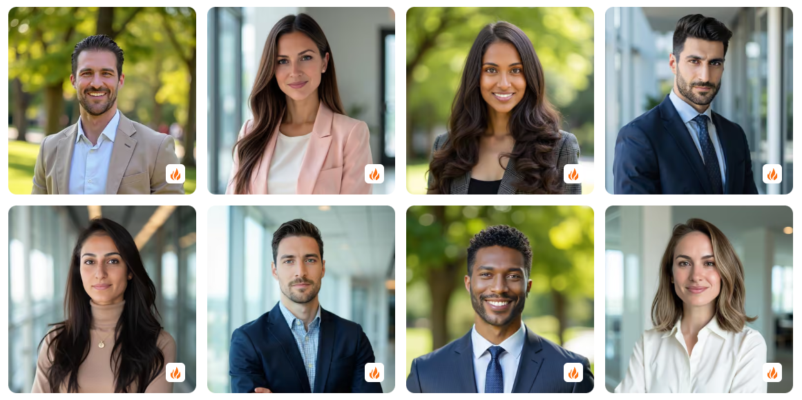
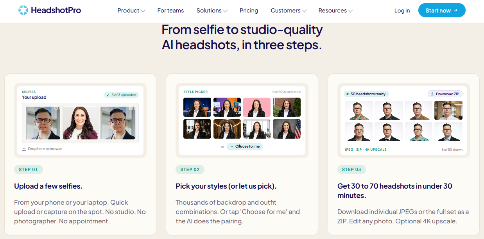
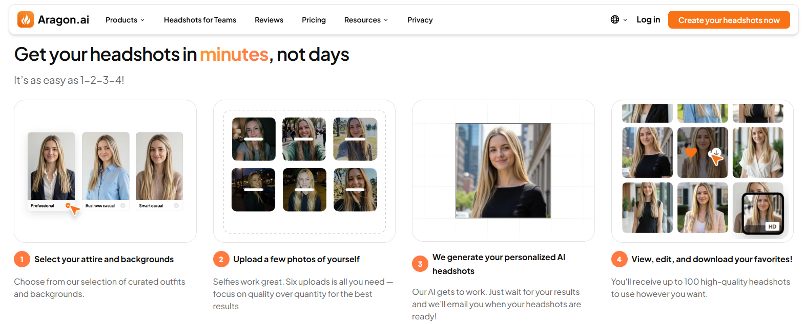
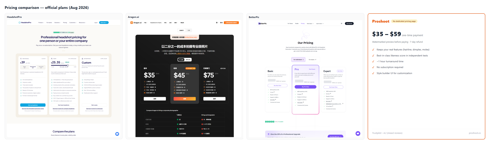
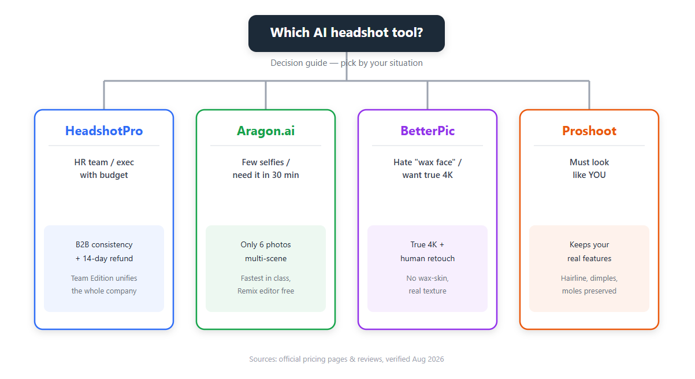

# 2026's Four Biggest AI Headshot Tools, Compared (We Read the Fine Print So You Don't Have To)

Our team needed new headshots last month. Twenty-something people. We priced a studio: $250 a head, plus everyone had to show up the same day, same wardrobe. That's a lot of coffee money. Then someone sent us an AI headshot link. Upload selfies, wait an hour, get dozens back.

So we went down the rabbit hole. The ads all say the same thing — "best AI headshot tool." We didn't have the time to buy and test every one. Instead we pulled official pricing pages, Trustpilot reviews, and Reddit threads, and shortlisted the four names that keep coming up: HeadshotPro, Aragon.ai, BetterPic, and Proshoot.

This isn't a sponsored ad. All four tools sit on the table — strengths, weaknesses, and the traps. You pick.

## How we compare

Four things decide a headshot tool. Everything else is noise:

- **Realism** — does it look like you, or like a wax figure?
- **Speed** — how long until you actually have the photos
- **Value** — what one usable photo really costs
- **Refund policy** — can you get your money back, and is the wording clear?

Here's the whole field at a glance:

| Tool        | From (one-time) | Turnaround | Photos | Trustpilot            | Best for                     |
| ----------- | --------------- | ---------- | ------ | --------------------- | ---------------------------- |
| HeadshotPro | $29             | 1–3 hrs    | 40–200 | 4.8 (~197k reviews)   | Teams, corporate consistency |
| Aragon.ai   | $35             | 15–90 min  | 40–100 | 4.9 (~6,100+ reviews) | Few selfies, speed, variety  |
| BetterPic   | $35             | 1–2 hrs    | 20–120 | 4.7 (~1,000+ reviews) | 4K, anti-wax-face            |
| Proshoot    | $35             | ~1 hr      | 40–200 | 4.2 (mixed)           | "Has to look like me" buyers |

Figures verified August 2026 from official pricing pages and public review roundups.

## Why one tool wants 15 photos and 2 hours, and the other gets by with 6 and 15 minutes

The short answer: they train differently.

- **HeadshotPro goes deep.** It runs Stable Diffusion with a **Dreambooth/LoRA** fine-tune. Your 10–15 photos get a temporary custom model trained on your face in the cloud — that's the 1–3 hour wait. Payoff: deeper facial capture and better handling of unusual angles. Cost: compute time and patience.
- **Aragon goes fast.** Pretrained model plus **facial feature embedding**, steered with quick ControlNet guidance. Six photos is enough to pull your features — no full retrain — so results land in 15 minutes. Trade-off: rare angles can drift more than a fine-tuned model.

That's the general explanation from public technical material and common industry practice. Actual implementations differ.

## HeadshotPro — the team pick

Start with the founder, because it tells you a lot. HeadshotPro is Danny Postma, a Dutch indie hacker who is loud on X (Twitter). Loud in a useful way: he builds in public. The tech stack, why he picked Stripe + Rewardful for a 30% affiliate program, how he plays SEO — he walks through all of it on podcasts and socials. In the AI SaaS world, HeadshotPro is the textbook case study.

**What it does**

- Upload 10–15 selfies. It trains on your face and returns dozens to hundreds of headshots.
- Big style library: 300+ backgrounds, 300+ outfit combos (it started at 60+).
- **Team Edition is the real differentiator.** HR invites the whole company, everyone uploads their own selfies, and the platform outputs one consistent style. An "About Us" page shot by thirty different photographers over the years looks messy. HeadshotPro fixes that in a single pass.
- Security is a selling point: SOC 2 Type II, and uploaded photos are auto-deleted within 7–30 days.

**Pricing** (one-time, no subscription)

- Basic $29: ~40 photos, 4 styles
- Professional $39: ~100 photos, 10 background/outfit combos — the pick for most people
- Executive $59: 200+ photos, priority processing
- Team pricing per person, volume discounts from 30 seats, enterprise lands around $20/employee

**What users actually say**
Trustpilot sits around 4.8/5 across roughly 197,000 customers. The praise is consistent: cheaper than a studio, zero awkwardness, and "closer to my face than I expected." One reviewer with braces said a few shots were unusable because of the teeth, but he still pulled several keepers.

The honest complaints:

- **Output depends on your input.** Dark, blurry, or tightly cropped selfies produce worse results. Every review site says the same.
- Occasional artifacts — glasses, hands, hairlines. In practice you'll find 5–10 winners out of dozens.
- No mobile app. No free tier.

**Who should buy / who should skip**

- Buy: HR teams, budget-conscious executives, anyone who needs a uniform company look.
- Skip: anyone who just wants a $19 taster, or needs photos "right now."

**One line:** Need a consistent team look with a refund that actually means something? This is the one.

> **Privacy note:** AI headshots touch your biometric data. HeadshotPro commits to deleting your model and source photos within 7–30 days (data retention policy). Buying for a company? Confirm no-trace training is enabled.

👉 **[Learn more & buy](https://www.headshotpro.com/?via=toolisme)** — backed by the 14-day Profile-Worthy refund guarantee

## Aragon.ai — the fast, low-barrier pick

Aragon is the name that keeps coming up next to HeadshotPro. The team story is credible: the site says core members are AI researchers out of MIT, Meta, and Google, backed by recognizable investors. Compliance is in order too — SOC 2 Type II, AES-256, and you can delete your account and data anytime (stated in their Trust Center).

**What it does**

- **Lowest entry bar: 6 selfies.** HeadshotPro wants 10–15. Aragon makes do with six.
- **Fastest turnaround in the category.** 15 minutes on Executive, 30 on Standard.
- **Remix is its signature.** After generation you can swap backgrounds, change outfits, adjust poses — free, no regeneration.
- Wide style spread: business, casual, travel, social packs. iOS and Android apps included.

**Pricing** (one-time, frequent promos)

- Basic $35: 40 photos, 45 min
- Standard $45: 60 photos, 30 min — the most popular
- Executive $75: 100 photos, 15 min, enhanced resolution
- Promo: 15% off everything with code **YBOFQHOR**

**What users actually say**
Trustpilot ~4.9/5 from 6,100+ reviews — the highest score at the highest volume here. The common takeaway: "lighting and skin texture beat HeadshotPro," fast, looks like a real studio.

The honest complaints:

- Occasional facial drift — eyes, teeth, lips can distort.
- No free tier for generation (editing tools are free; generation isn't).
- One reviewer put likeness at "about 70%" — expect to pick through results.

**Who should buy / who should skip**

- Buy: you have few selfies, a deadline, or you want casual and travel-style shots.
- Skip: you can't tolerate anything short of "100% my face" and hate picking photos.

**One line:** Few selfies, fast results, wide variety — Aragon's your play.

👉 **[Learn more & buy](https://www.aragon.ai/?via=toolisme)** — code YBOFQHOR saves 15% on everything

## Briefly: BetterPic — 4K, and no "wax face"

If resolution is your religion and AI "wax skin" is your pet peeve, glance at BetterPic. **Every tier ships true 4K**, skin texture and lighting hold up under zoom, and the Expert plan ($79) throws in **human retouching** — unlimited edits on one photo.

$35–$79 one-time, Trustpilot ~4.7/5. The catches: the top tier is the priciest in this lineup, turnaround runs 1–2 hours (slower than Aragon), and the 7-day refund dies the moment you download.

👉 **[Learn more](在此填入你的 BetterPic 联盟链接)**

## Briefly: Proshoot — the "still looks like me" pick

Scared the AI will hand you a stranger who shares your haircut? Proshoot optimizes for likeness. It keeps your hairline, your dimples, your moles — the real features — instead of smoothing them into generic beauty. Independent tests often rank it first on similarity.

$35–$59 one-time. You preview watermarked shots before paying, 7-day refund. The catches: ~1 hour turnaround (slower than Aragon), and the style-builder UI takes some getting used to.

👉 **[Learn more](https://www.proshoot.co?ref=toolisme)**

## Which one should you actually buy?

We won't decide for you, but here's the decision tree:

- **HR team / executive with budget** ➔ HeadshotPro (B2B consistency + 14-day Profile-Worthy refund)
- **Few selfies / want it in 30 minutes** ➔ Aragon.ai (6 photos, multi-scene)
- **Pixel-peeper / allergic to wax faces** ➔ BetterPic (4K + human retouch)
- **"It has to look like ME"** ➔ Proshoot (feature-preserving likeness)

## How we wrote this (the transparent bit)

We did not personally pay for and test all four tools. Sources: official pricing and feature pages, Trustpilot, Reddit, and third-party reviews (ToolCrush, Dupple, AItoolsbakery, ToolChase), verified August 2026. Every negative claim traces back to a real source. Prices change — check the official site before you buy.

## Affiliate disclosure

This article contains affiliate links. If you buy through one, we may earn a commission. It does not affect our coverage, our scores, or what we say. We only write about tools we'd actually consider using.

---

*Sources: headshotpro.com/pricing, aragon.ai/pricing, betterpic.io, proshoot.co, Trustpilot product pages, ToolCrush / Dupple / AItoolsbakery / ToolChase (verified August 2026). Figures as published; confirm on the official sites.*

P.S.: Drop your email and I'll send you a free checklist — the five things to verify before you buy an AI headshot pack.
