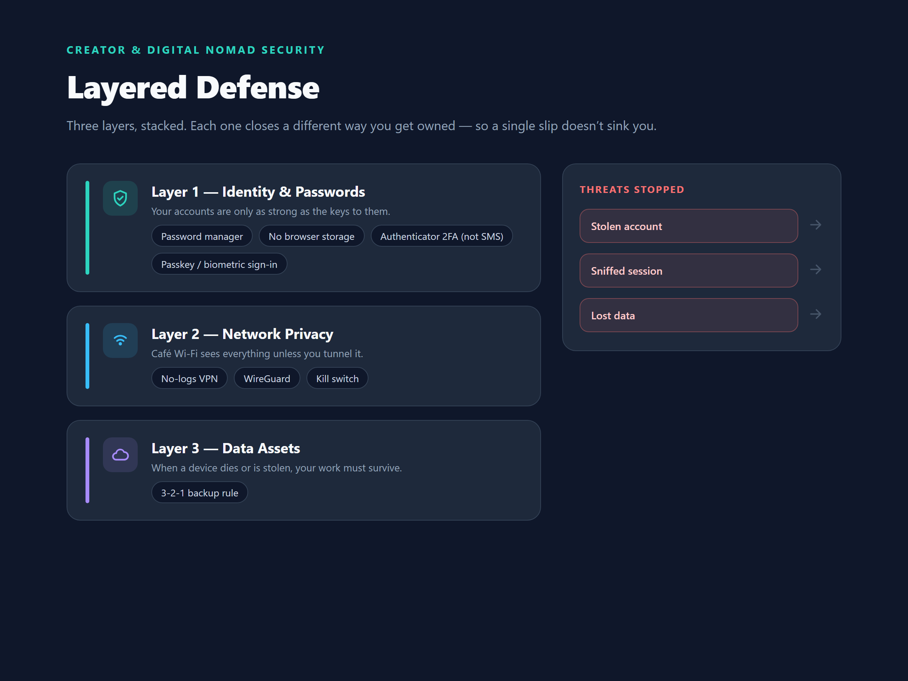

我们认识一个做视频的创作者，账号被盗，两年素材和几万粉丝一夜之间清零。另一个朋友，笔记本电脑硬盘突然报废，存了半年的剪辑工程全没了。这两个人有一个共同点：出事之前，他们都觉得"我这种小人物，黑客看不上"。

安全这件事，跟身价无关，跟习惯有关。它不是花大钱买一堆安全软件，而是养成**分层防御**的习惯——每一层都不指望防住所有攻击，但叠起来，绝大多数常见的翻车场景都能拦住。

## 第一层防线：身份与密码

**先改掉一个习惯：别再让浏览器帮你存密码。** 浏览器密码库的问题不是技术，是使用场景——它跟着浏览器走，换设备、换浏览器、重装系统，密码跟着丢；而且一旦浏览器被恶意插件或脚本利用，密码库等于裸奔。更别说很多人干脆把所有网站用同一个密码，一个泄露，全网沦陷。

**密码管理器的选型，核心看两件事：**

1. **云端全平台同步**——手机、电脑、平板都能用，随时取密码。这一类以 [1Password](/reviews/security/1password-review-2026) 为代表，体验顺滑，适合不想折腾的人。
2. **开源自建 / 自托管**——密码库存在你自己的服务器上，数据主权在自己手里。以 [Bitwarden](/reviews/security/bitwarden-review-2026) 为代表，适合对数据隐私要求高、愿意花点时间配置的人。

两个方向没有谁绝对好，看你的取舍：**图省事选托管，图主权选自建**。

**二次验证（2FA）避坑：能不用短信就别用。** 短信验证码可以被 SIM 卡劫持拦截，这两年案例不少。优先用 Authenticator 应用（Google Authenticator、Authy 这类）或硬件安全钥匙（YubiKey 这类）。我们的原则：重要的账号——邮箱、密码管理器、支付、域名——全部开 Authenticator，密码管理器本身更要开，它是所有密码的总闸。

**Passkey（通行密钥）值得单独说一句。** 现在 Google、Apple 和 1Password 这类密码管理器都普及了 Passkey——用设备生物识别（指纹/面容）直接登录，免去输密码的麻烦，还能在物理层面避开绝大多数钓鱼网站。我们自己的主力账号，能开 Passkey 的都开了：登录更快，还不用记新密码。

## 第二层防线：公共网络与隐私

咖啡馆、机场、酒店的公共 WiFi，是创作者出门在外的日常，也是中间人攻击的高发区。攻击者不需要多高深的技术，同一网络里放一个抓包工具，就能看到明文传输的会话。所以，如果你经常用公共 WiFi，VPN 是你的保护伞，但选 VPN 有讲究。

**VPN 选型三条铁律，少一条都不建议碰：**

1. **无日志政策（No-Logs）**——服务商声称不记录你的浏览记录和流量内容。这条要看成文条款，不是看官网宣传语。
2. **支持 WireGuard 协议**——新一代加密协议，速度和安全性比老的 OpenVPN 好，连接快，耗电低。
3. **Kill Switch（断网开关）**——VPN 意外断开时自动切断网络连接，防止流量在无保护状态下漏出去。

> ⚠️ **避坑铁律**：如果一个 VPN 服务是免费的，那你大概率不是它的客户，而是它的商品。不要用免费 VPN 传输任何包含 Cookie 或登录凭据的流量。

免费 VPN 的盈利模式，绕不开广告、把带宽当出口卖、或者数据日志本身就是商品这几类。认真对待隐私的人，免费 VPN 是最不该碰的那一类——要用就用有口碑的付费服务，或者干脆用流量够的手机热点应急。

💡 想看主流 VPN 的加密速度与节点实测？我们的 [2026 顶级 VPN 横向对比](/comparisons/best-vpn-2026) 上线后会补全实测数据。

## 第三层防线：数据资产 3-2-1 备份

账号安全守住了，数据还得防物理灾难——硬盘坏了、电脑被偷、勒索软件加密。备份的标准做法是 **3-2-1 原则**：

- **3 份副本**——原始数据 + 至少两份备份；
- **2 种介质**——不能都在同一块硬盘上（比如本地外置盘 + 云端）；
- **1 份异地**——至少一份存在物理上不同的地方（比如云端或另一座城市的服务器）。

具体到创作者，实操建议：

- **视频素材 / 剪辑工程**：工作目录 + 外置硬盘（定期全量）+ 云端冷备（项目归档后传一份）。
- **代码库**：git 远程仓库本身是一份异地备份，再定期把重要分支导出到云端即可，不用重复备份。
- **财务数据 / 合同**：加密压缩后存云端，本地留一份纸面或离线副本。

## 安全自查清单

框架讲完，把动作列成清单，逐条打勾。没做到的先从最痛的那条开始补：

- [ ] 密码管理器已启用，浏览器不再存密码
- [ ] 所有账号密码不重复（重要的至少保证邮箱和支付不重复）
- [ ] 邮箱、密码管理器、支付、域名已开启 Authenticator 2FA
- [ ] 公共 WiFi 一律走 VPN，或只用手机热点
- [ ] VPN 确认过 No-Logs 条款、WireGuard、Kill Switch
- [ ] 数据按 3-2-1 备份，最近一次备份时间不超过 1 个月
- [ ] 密码管理器和重要云端账号都开了异地恢复（手机号/恢复码）

## 结语与下一步

安全不是一次性的工程，是一组可以养成的习惯。密码管理器 + Authenticator、靠谱的 VPN、3-2-1 备份，这三件事做完，创作者最常见的三类翻车——账号被盗、公共网络被劫持、数据丢失——就都有一层兜底了。

我们正在陆续上线安全类工具的深度实测（密码管理器、VPN 的实际体验对比都会覆盖），想第一时间看到，收藏我们的 [Security 分类页](/reviews/security)；想先补选型框架的，[全部 Buyer's guides](/guides) 在这里。

> 💡 安全工具的评测和横向对比我们按"先框架、后清单、再落地"的结构持续更新，框架篇负责帮你建立认知，实测篇负责验证到底行不行。
