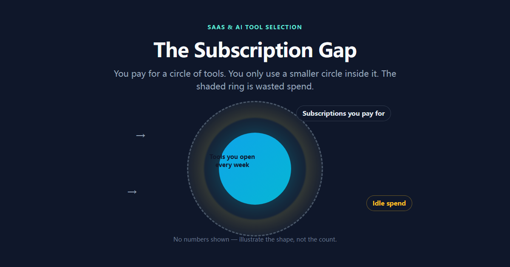

Most teams we researched pay for far more tools than they actually use — the ones opened every day usually number two or three, against a bill that's $200+ a month.

The rest aren't useless. They're just not worth a monthly fee. Some are trials that never got canceled. Some looked feature-rich at the moment of purchase and never got touched past the dashboard tour. That's subscription fatigue — more tools, not more output, and a bill that climbs on its own.

So this guide isn't about specific products. It's a framework. One line to remember: **don't pay for features. Pay for workflows.**

## Step 1: Split your needs into three pipelines

Before you buy anything, break the work down. After years of watching small teams and solo creators, we keep landing on the same three pipelines:

1. **Productivity & core workspace** — project management, docs, knowledge base. Decide here: one all-in-one, or a few sharp point tools.
2. **User communication & interaction** — presentations, feedback, email marketing. Anything that faces outward lives here.
3. **AI power & assisted production** — writing, editing, code generation. Match it to what you actually ship, not to the hype.

Each pipeline needs **one primary tool**. Add them up and your Minimum Viable Stack lands at around three — that's what a small team's subscription bill should look like.

We've seen worse: a five-person team paying for three project-management tools at the same time. Why? People came and went, everyone kept their favorite, and nobody canceled after they left. That's not a tool problem, that's a management problem.

One more thing on pipeline three: if video editing is part of your week, our [creator & digital nomad security guide](/guides/creator-nomad-security-guide) covers how to keep footage safe (local + cloud + offsite copy) — learn it before a drive dies, not after.

## Step 2: The five-minute pre-subscribe checklist

Found something promising? Don't hit subscribe yet. Run these four checks. They'll stop most impulse purchases cold:

**1. Billing: per seat or per usage?**
Seat-based tools charge more for every member you add. If freelancers or outside collaborators are involved, run the math before you commit. Usage/API-based tools look cheap on the sticker but can get expensive fast. What matters is **which model matches how you'll actually use it** — not the headline price.

And watch for **seat tiering**: a tool advertises $10/seat/month, but the minimum order is five seats. Even a solo user pays for five. It's a quiet little trick that's everywhere in 2026.

**2. AI quota: does "unlimited" have fine print?**
Plenty of tools claim unlimited AI, then the terms reveal daily caps, rate limits, or peak throttling. Multiple user reports flag tools that advertise "unlimited" AI but cap it in the terms — for example, 50 generations a day, then paid credits. **Read the terms first.** Same story with APIs: the marketing page says "API access," the docs say 3 requests per minute — useless for any batch automation. Check the Rate Limit section before you trust it.

**3. Collaboration cost: do outsiders need paid seats?**
If you work with clients, freelancers, or short-term members, find out whether they need their own paid account. Some tools offer free guest seats; some don't. When they don't, one collaboration is one subscription.

**4. Data export: can you leave, or are you locked in?**
One-click export to Markdown, CSV, or a real API means you can switch tools anytime. Data locked inside a platform means leaving costs you a full re-entry of everything. **Migration cost is the hidden cost** — you only notice it the day you try to leave.

## Step 3: Skip straight to your scenario

Framework aside, here are the scenarios reflected in user reports and our research. Find yours:

**Scenario A: you need interactive demos, training, or audience feedback — without enterprise pricing**
A lightweight live-polling tool covers it. Based on user feedback and our research, [AhaSlides](https://ahaslides.com/?red=toolis&utm_source=toolis&utm_medium=revshare&utm_affiliate_network=reditus) (free tier handles 50 participants) does live polls, word clouds, and Q&A well enough for everyday team use — see our [AhaSlides review](/reviews/software/ahaslides-review-2026) for the full picture. No reason to pay enterprise rates for features you'll touch twice a year.

<a href="https://ahaslides.com/?red=toolis&utm_source=toolis&utm_medium=revshare&utm_affiliate_network=reditus" target="_blank" rel="sponsored noopener noreferrer" style="display:inline-block;background:#fbbf24;color:#0f172a;padding:12px 22px;border-radius:8px;font-weight:700;text-decoration:none;margin:10px 0;">🚀 Try AhaSlides Free (50 Participants, No Card) →</a>

**Scenario B: cold email marketing — you care about landing in the inbox, not just sending**
The easiest mistake here is chasing volume before deliverability. Based on user feedback and our research, [WarmupInbox](https://warmupinbox.com/?red=toolis) warms your sending domains through a real inbox network and pairs with email verification — users report noticeably steadier inbox rates than sending cold — covered in our [WarmupInbox review](/reviews/software/warmupinbox-review-2026). If "getting delivered" is the goal, fix deliverability first, then talk about volume.

<a href="https://warmupinbox.com/?red=toolis" target="_blank" rel="sponsored noopener noreferrer" style="display:inline-block;background:#fbbf24;color:#0f172a;padding:12px 22px;border-radius:8px;font-weight:700;text-decoration:none;margin:10px 0;">🚀 Try WarmupInbox (7-Day Trial, No Card) →</a>

**Scenario C: B2B outreach — you need verified leads at scale**
For lead data, based on user feedback and our research, [Snov.io](https://snov.io?fp_ref=hu82) combines email search and verification in one flow, so invalid addresses get filtered before they hit your sender reputation — full breakdown in our [Snov.io deep-dive](/reviews/software/snovio-review-2026).

**Scenario D: video / YouTube — you want AI-written scripts**
Script tools have gotten crowded. Our [TubeMagic vs Subscribr comparison](/comparisons/software/tubemagic-vs-subscribr-2026) covers the two big angles: one is built for batch production, the other for retention-focused hooks. Pick by your content cadence — don't subscribe to both.

> 💡 **Decision logic (compiles into a dynamic Quiz):** the four scenarios above are a need → tool map. Match your core need to the right tool. For an interactive version, this logic feeds our web-based decision Quiz.

## The habit that actually fixes the bill: quarterly audits

Frameworks pick the right tool, but the bill grows back quietly on its own. What consistently works is a **quarterly subscription audit**:

- Pull the credit card statement, list every tool and its price;
- For each one: how many times did I open it this month? Is there a free alternative doing the same job?
- Anything untouched for two quarters — cancel;
- Before canceling, check for annual-lock commitments. Don't save a month to get locked for a year.

Two rounds of this, and users frequently report 30–40% savings. The money saved goes back into upgrades on the tools they genuinely depend on.

## Bottom line

Back to the opening line: **don't pay for features, pay for workflows.** Three pipelines, four checks, one audit — that's enough to keep 90% of subscriptions in line.

Ready to compare actual tools? Our [top tools comparison](/comparisons/software) tables are sorted by budget and use case. Prefer single deep-dives first? The [latest reviews](/reviews/software) are all there.

> 💡 New to the framework-first approach? Our [buyer's guides](/guides) all follow the same structure — framework, checklist, then the real-world picks.

---

## P.S.

This is the software pillar of our guide series. The security pillar ([creator & digital nomad security guide](/guides/creator-nomad-security-guide)) is live, and the hardware pillar (keyboards, monitors, budget tiers) is on the way — bookmark [guides](/guides) so you catch the whole stack.
