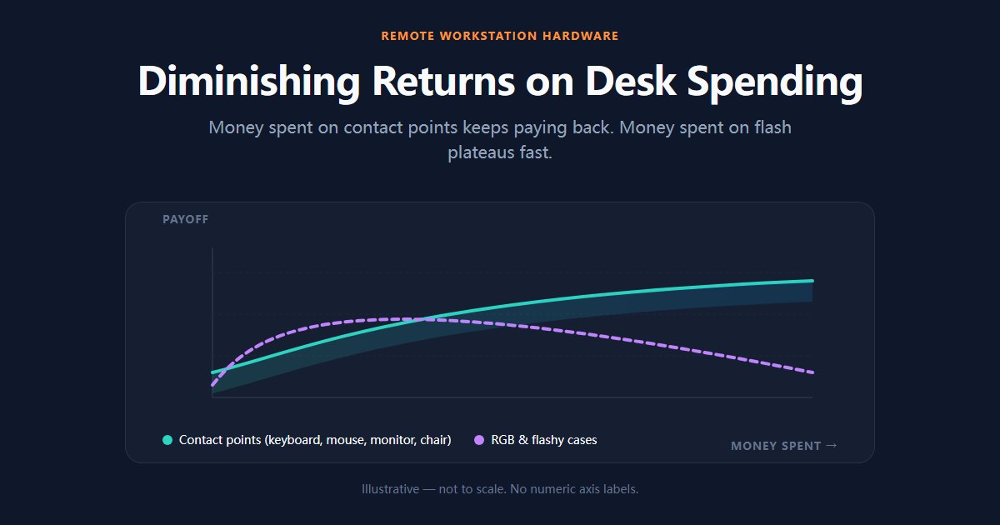

我们每天在电脑前坐 8 个小时以上。算下来，桌面上的键盘、鼠标、显示器、椅子，是跟身体直接接触时间最长的设备。但大多数人买电脑愿意花大几千，轮到这些"小件"就随便凑合——一把几十块的键盘，一块看两小时就酸的眼睛，一把硬邦邦的椅子。

硬件消费有很强的**边际递减效应**：花钱在花哨的灯效、炫酷的机箱上，收益很快就到顶；而花在身体直接接触的节点上——键盘、鼠标、显示器、椅子——每一块钱都实打实换回手、腕、脖子和专注度。

所以这篇指南把桌面拆成**五大模块**：**输入（键盘/鼠标）→ 显示（屏幕/挂灯）→ 连接（拓展坞/理线）→ 支撑（升降桌/椅子）**。按这个顺序分配预算，先解决手和眼，再解决线和腰。

## 模块一：键盘——先解决手的问题

键盘是跟你手接触时间最长的设备，值得花最多心思。机械键盘的选购，我们拆成三个问题：

**1. 结构：Gasket 还是传统船壳？**

结构决定手感的下限。Gasket 结构通过在定位板与外壳之间加缓冲垫，让按键下压时有一定形变空间，手感更软弹、声音更纯净，是目前客制化圈的主流。传统船壳结构硬朗、声音更响，但便宜可靠。

**我们的实测感受：** 如果你每天大量打字（写代码、写稿、回消息），Gasket 结构的"软着陆"确实更省手指疲劳；如果只是偶尔用、预算优先，船壳完全够用，别被参数带节奏。

**2. 连接：为什么三模是刚需？**

三模 = 蓝牙 + 2.4G + 有线。多设备切换是远程办公的常态——笔记本、台式机、平板来回切。三模键盘可以在设备间一键切换，不用拔线插线。只想用有线或单蓝牙的，省点钱也行，但"多设备党"建议直接上三模。

**3. 轴体：线性还是段落？**

- **线性轴**：直上直下，没有段落感，按起来顺滑。适合长时间高速输入（写代码、赶稿），声音也相对安静。
- **段落轴**：按下到一半有明显的"咔哒"触发感，打字反馈感强，适合喜欢"有回馈"的人，但声音更响，长时间按手指更累一点。

我们的建议：办公室/共享空间优先线性轴（安静、省力），独享空间且有手感追求的可以试段落轴。拿不准就买带热插拔的，轴体随时换，一次试个够。

> 💡 键盘的基础选型逻辑（布局兼容性、端口、品控、保修）我们在 [《如何选机械键盘》](/guides/how-to-choose-a-mechanical-keyboard) 里有完整的分步框架，先看那篇再进键盘的深水区。

想找一款兼顾全金属质感、三模连接与 Gasket 软弹手感的量产客制化键盘？我们深度实测过 [Keychron Q1 Max](/reviews/hardware/keychron-q1-max-review-2026)（支持 QMK/VIA 深度改键），评测里手感、结构、续航都拆开讲了。想直接看价格和现货的，亚马逊上也常年在售：

<a href="https://amzn.to/3S4Rxjf" target="_blank" rel="sponsored noopener noreferrer" style="display:inline-block;background:#fbbf24;color:#0f172a;padding:12px 22px;border-radius:8px;font-weight:700;text-decoration:none;margin:10px 0;">👉 查看 Keychron Q1 Max 最新价格（亚马逊）→</a>

> 💡 **键盘决策逻辑（可直接编译成动态 Quiz）**：三个问题（结构 → 连接 → 轴体）依次作答，就能锁定适合自己的键盘。交互版交给网页生成问答式决策树。

## 模块二：鼠标——别让"鼠标手"毁了你

键盘讲完，鼠标不能不讲。长时间用普通鼠标，前臂肌肉紧张、手腕酸痛（俗称"鼠标手"）是远程工作者最常见的问题之一。选鼠标看两条路径：

- **追求效率与生产力**：选支持**自由滚动/疾速滚轮**和**多设备无缝切换**的鼠标，跨屏拖文件、长文档滚动都顺。
- **追求手腕健康**：选 **57° 垂直倾角**设计的人体工学鼠标，让前臂保持自然握手姿势，减轻正中神经压力。

### 📌 我们的精选推荐

**【全能旗舰】Logitech MX Master 3S**
*适合：程序员、剪辑师、多任务办公者*
8000 DPI 玻璃表面追踪、静音按键、MagSpeed 电磁滚轮，一键在 Mac/Windows 间跨屏复制粘贴。

<a href="https://amzn.to/4zeJ8KF" target="_blank" rel="sponsored noopener noreferrer" style="display:inline-block;background:#fbbf24;color:#0f172a;padding:12px 22px;border-radius:8px;font-weight:700;text-decoration:none;margin:10px 0;">👉 查看 Logitech MX Master 3S 最新价格（亚马逊）→</a>

**【护腕首选】Logitech MX Vertical / Lift**
*适合：每天用鼠标 6 小时以上、手腕酸痛者*
57° 垂直握姿释放手腕压力。手小的选 Lift，手大的选 MX Vertical。

<a href="https://amzn.to/4ibiY5m" target="_blank" rel="sponsored noopener noreferrer" style="display:inline-block;background:#fbbf24;color:#0f172a;padding:12px 22px;border-radius:8px;font-weight:700;text-decoration:none;margin:10px 0;">👉 查看 Logitech MX Vertical 最新价格（亚马逊）→</a>

<a href="https://amzn.to/4gbvD5X" target="_blank" rel="sponsored noopener noreferrer" style="display:inline-block;background:#fbbf24;color:#0f172a;padding:12px 22px;border-radius:8px;font-weight:700;text-decoration:none;margin:10px 0;">👉 查看 Logitech Lift 最新价格（亚马逊）→</a>

## 模块三：显示——清晰度和颈椎一起解决

**单大屏还是双屏？** 这是远程工作者最常见的纠结。

- **单大屏（4K 32 寸左右）**：一块屏搞定所有，没有拼接缝，视觉沉浸感好，适合专注单任务——写代码、剪视频、深度阅读。
- **双屏组合**：一边主工作、一边放参考/聊天/资料，适合多任务并行——写稿配查资料、剪辑配时间轴、对数据配报表。

没有绝对答案，看你的工作流。我们自己的经验：**先有一块能撑起主任务的大屏，再考虑要不要第二块**。很多人的第一块屏分辨率不足，第二块屏只是把模糊分摊成了两份。

**护眼指标，下单前看三个：**

1. **调光方式**：避开低频 PWM 调光，高频调光或 DC 调光对眼睛更友好——长时间盯着，闪烁敏感的人会明显感觉到差异。
2. **色域覆盖**：做设计、视频的看 sRGB/DCI-P3 覆盖；纯办公的不用为广色域多花钱。
3. **支架高度**：屏幕顶端应该平视或略低于平视，支架/臂架把屏幕抬到正确高度——颈椎的收益都在这里。

**屏幕挂灯值得单独提一句：** 夜间工作环境光差，台灯占地方又反射屏幕光。屏幕挂灯（如 BenQ ScreenBar 这类非对称光路设计）只照亮桌面、不照屏幕，还能腾出桌面空间。几十到几百块价位都有，是桌面小件里性价比很高的一笔。

## 模块四：连接——把"盘丝洞"变成一线连

笔记本外接大屏、键鼠、硬盘，插拔线缆烦不烦？桌面线缆乱不乱？**雷电拓展坞（Docking Station）**是解决这个问题的核心配件：

- **一线连**：笔记本一根雷电 4 线接坞，显示器、网线、键鼠、供电全走坞——坐下插一根，走人拔一根。
- **看什么**：供电功率（能不能带得动笔记本）、视频输出（能不能带双 4K）、接口数量（USB-A/USB-C/读卡器）。

主流品牌 CalDigit、Anker、Ugreen 都有对应产品线，按接口需求选，不用追最贵的旗舰。如果只是偶尔外接，一个 USB-C 转 HDMI 的小转接头也可能够用——先想清楚你的插拔频率再决定。

**桌面理线**和**显示器支架**是两个容易忽略的小件：理线槽/魔术贴把线收进桌底，支架臂把屏幕抬起来——这两件加起来可能不到一顿饭钱，桌面观感和颈椎收益都明显。

## 模块五：支撑——键盘和屏幕救不了你的腰

最后是客单价最高、也最容易被忽略的一环：**人体工学椅和升降桌**。久坐腰痛、颈椎劳损，只有屏和键盘救不了腰。

**升降桌（坐站交替）：**
双电机、静音、承重强的型号是主流选择（FlexiSpot、Autonomous 这类品牌都有成熟产品线）。坐 45 分钟、站 15 分钟的节奏，配合升降桌是最有效的"久坐解药"。预算紧张可以先买手摇升降或升降桌腿，电机款等预算到位再升级。

<a href="https://amzn.to/4gc8rUV" target="_blank" rel="sponsored noopener noreferrer" style="display:inline-block;background:#fbbf24;color:#0f172a;padding:12px 22px;border-radius:8px;font-weight:700;text-decoration:none;margin:10px 0;">👉 查看升降桌最新价格（亚马逊）→</a>

**人体工学椅：**
这是桌面硬件里"一分钱一分货"最明显的一件。入门到进阶看 **Branch / Ergohuman** 这类，预算充足一步到位看 **Herman Miller Aeron / Embody** 这类经典款。**买椅子前先确认三件事**：腰托可调高度、坐深可调、扶手可调——一把不能调节的"工学椅"只是看起来像。

<a href="https://amzn.to/4i8apZ5" target="_blank" rel="sponsored noopener noreferrer" style="display:inline-block;background:#fbbf24;color:#0f172a;padding:12px 22px;border-radius:8px;font-weight:700;text-decoration:none;margin:10px 0;">👉 查看人体工学椅最新价格（亚马逊）→</a>

## 三档预算怎么分（含推荐组合）

给三档常见预算的分配建议（不含主机），按"输入 > 显示 > 连接 > 支撑"的优先级：

| 预算档 | 键盘 & 鼠标 | 显示器 & 支架 | 支撑与连接 | 预期体验 |
| :--- | :--- | :--- | :--- | :--- |
| **$500 入门** | 三模键盘入门款 + 基础办公鼠标 | 27 寸 2K 高刷 + 普通支架 | 笔记本支架 + 基础工学椅 + USB-C 转接头 | 先把基础手感和眼部舒适度建立起来 |
| **$1500 进阶** | Gasket 三模 + MX Master 3S 级鼠标 | 27-32 寸 4K 一线连 + 支架臂 | 入门升降桌 + 进阶工学椅 + 雷电拓展坞 | 消除线缆乱象，实现坐站交替 |
| **$3000 高配** | 客制化套件 + 旗舰键鼠 | 32 寸 4K 旗舰屏 + 高端支架臂 | 高端升降桌 + Herman Miller 级椅 + 雷电坞 | 每个节点都用很多年不后悔 |

**避坑提示：** 键盘和椅子的价格水分最大，同一款产品在不同渠道差价明显；显示器认准面板参数而不是"电竞"标签。预算有限时，**优先砸键盘**——它是你每天摸得最多的设备，也是体感差异最直接的一件。

## 总结与下一步

把顺序再重复一遍：**先键盘鼠标，再显示器，再连接和支撑**。按这个优先级花预算，每一块钱都落在身体直接接触的节点上，收益最实在。

想深入键盘的选购细节，读我们那篇 [《如何选机械键盘》](/guides/how-to-choose-a-mechanical-keyboard)，从兼容性到保修逐条拆。我们在测的量产客制化键盘深度评测（结构、轴体、手感逐项对比）也会陆续上线，随时关注 [Hardware 分类页](/reviews/hardware) 或 [全部 Buyer's guides](/guides)。

> 💡 硬件篇和其他指南一样，遵循"先框架、后清单、再实测"的结构——框架帮你建立认知，实测验证"参数到底爽不爽"。
